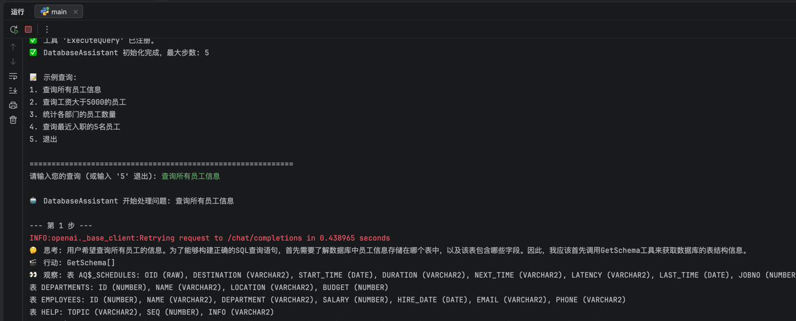
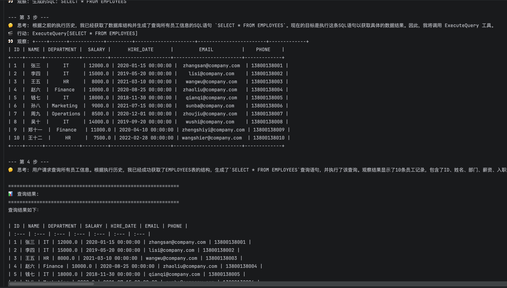
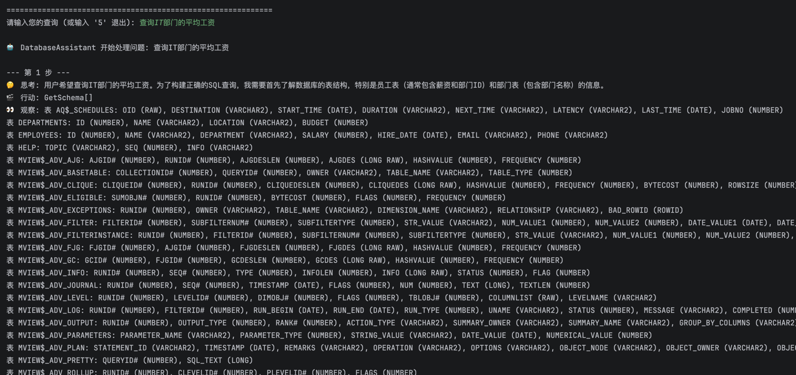
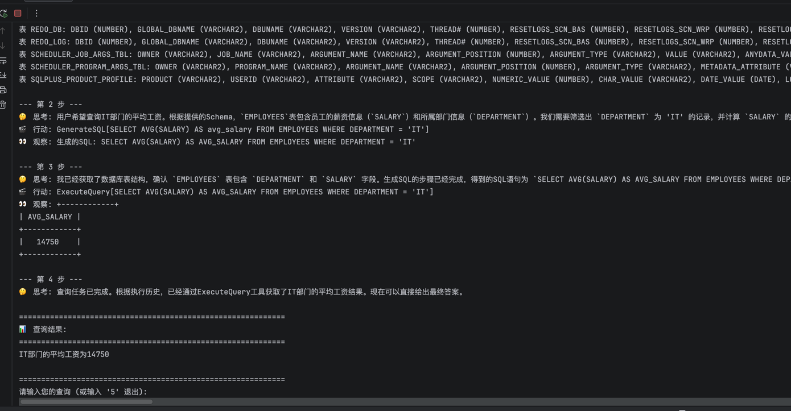

# 数据库Agent助手

基于hello-agents库实现的智能数据库查询助手，支持将自然语言转换为SQL查询并从Oracle数据库获取数据。

## 📝 项目简介

- 输入自然语言，自动生成SQL语句并执行查询
- 支持Oracle数据库，返回格式化的查询结果
- 适用于非技术人员查询数据库或者辅助技术人员快速生成SQL


## ✨ 核心功能

- **自然语言转sql**: 用中文描述查询需求，自动转换为SQL语句
- **Oracle数据库查询**: 查询oracle数据库并返回结果


##  🛠️ 技术栈

基于HelloAgentsLearn项目中的ReAct框架实现:

- **ReAct Agent**: 推理-行动循环框架
- **Tool Registry**: 工具注册和管理
- **LLM Integration**: 大语言模型集成
- **Oracle DB**: Oracle数据库连接和查询

## 工具实现

1. **GetSchema**: 获取数据库表结构信息
2. **GenerateSQL**: 将自然语言转换为SQL语句
3. **ExecuteQuery**: 执行SQL查询并返回结果

## 🚀 快速开始
### 环境要求

- Python 3.10+
### 安装依赖

```bash
pip install -r requirements.txt
```

### 配置API密钥

1. 复制示例配置文件:
```bash
cp .env.example .env
```

2. 编辑 `.env` 文件，配置以下参数:

### LLM配置
- `LLM_MODEL_ID`: 模型ID，如 `qwen3.6:35b-a3b-q4_K_M`
- `LLM_API_KEY`: API密钥
- `LLM_BASE_URL`: API服务地址

### Oracle数据库配置
- `DB_HOST`: 数据库主机地址
- `DB_PORT`: 数据库端口 (默认: 1521)
- `DB_SERVICE_NAME`: 服务名称
- `DB_USERNAME`: 用户名
- `DB_PASSWORD`: 密码


### 创建测试数据
使用提供的SQL脚本创建测试表和数据:

```bash
# 在Oracle SQL*Plus或其他Oracle客户端中执行
sqlplus 用户名/用户密码@数据库地址:1521/服务名称 @setup_database.sql
# 例如:
sqlplus system/password@localhost:1521/ORCL @setup_database.sql
```
### 运行项目

#### 运行测试程序
python test.py

#### 运行主程序:

```bash
python main.py
```

#### 查询示例

- "查询所有员工信息"


- "查询IT部门的员工平均工资"




## 🔮 未来计划

- 增加plan_solve智能体实现查询
- 增加更多数据库支持
- 优化提示词设计
- 优化sql工具
- 增加查询结果导出功能

## 🤝 贡献指南

欢迎提出Issue和Pull Request！

## 📄 许可证

MIT License

## 👤 作者

- GitHub: [@939147533](https://github.com/939147533)

## 🙏 致谢

感谢Datawhale社区和Hello-Agents项目！