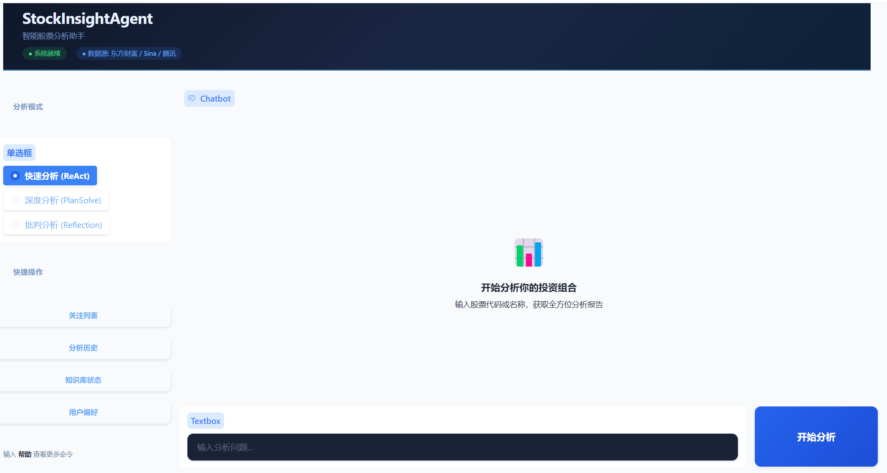
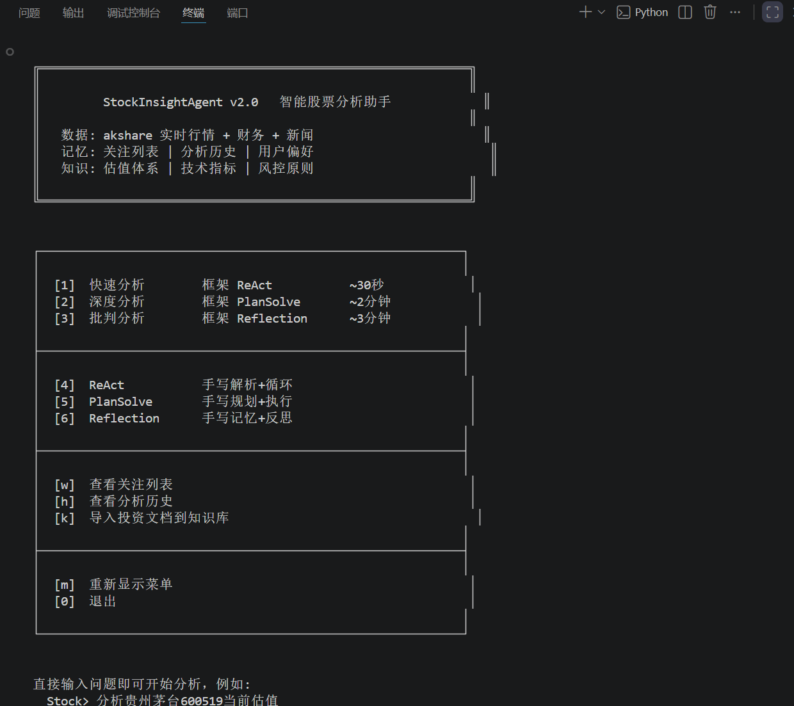

# StockInsightAgent — 智能股票分析助手

> 融合多源实时数据与大模型推理，从技术面、基本面、消息面三维度综合分析 A 股，输出结构化投资分析报告。

## 📝 项目简介

传统股票分析依赖人工阅读财报、新闻和技术指标，效率低且易受主观情绪影响。StockInsightAgent 基于 Hello-Agents 教程构建，自动获取东方财富/新浪/腾讯的实时行情数据，结合大语言模型对信息进行综合解读，输出包含趋势判断、风险提示、支撑压力位和操作建议的完整分析报告。

- **解决了什么**：信息碎片化、分析效率低、缺乏系统性视角
- **特色**：三种 AI 范式切换（ReAct / PlanSolve / Reflection），记忆系统个性化，Gradio 前端流式交互
- **适用场景**：个人投资研究辅助、量化分析入门学习、智能体开发教学参考

## ✨ 核心功能

- **实时行情** — 股价、涨跌幅、成交量、市盈率
- **历史 K 线** — 日线/周线数据，前复权
- **技术指标** — MA5/10/20/60、MACD(金叉死叉)、RSI(14)、布林带、支撑压力位
- **财务报表** — 营收、净利润、ROE、毛利率、资产负债率、每股收益
- **新闻舆情** — 近期公司及行业新闻
- **关注列表** — 持久化关注股票，自动个性化分析
- **分析历史** — 记录每次分析结论，支持跨会话回溯
- **投资知识库** — 内置 PE/PB/PEG 估值体系、技术指标解读、仓位管理、止损原则、A 股规则
- **对话上下文管理** — 长对话自动压缩，保持多轮分析连贯

## 🛠️ 技术栈

| 层面 | 技术 |
|------|------|
| Agent 框架 | Hello-Agents (ReActAgent / PlanSolveAgent / ReflectionAgent) |
| 数据源 | akshare (东方财富 / 新浪 / 腾讯接口) |
| LLM 接入 | OpenAI 兼容接口 (DeepSeek / GPT / 本地模型均可) |
| 前端 | Gradio Chatbot (流式输出) |
| 记忆系统 | JSON 持久化 (关注列表 / 历史 / 偏好) |
| 知识库 | TF-IDF 检索 + 中文 2-gram 分词 |
| 技术指标 | NumPy + Pandas 自主计算 (非调用外部库) |

**智能体范式**:

| 范式 | 来源 | 特点 |
|------|------|------|
| ReAct | 教程第 4 章 | Thought → Action → Observation 循环，工具驱动推理 |
| Plan-and-Solve | 教程第 4 章 | 先规划分析维度再逐步执行，适合深度研究 |
| Reflection | 教程第 4 章 | 分析→自我评审→改进，2 轮迭代逼近最优报告 |

## 🚀 快速开始

### 环境要求

- Python 3.10+
- 兼容 OpenAI 接口的 LLM API (DeepSeek / OpenAI / 其他)

### 安装

```bash
pip install -r requirements.txt
```

### 配置

```bash
cp .env.example .env
```

编辑 `.env`，填入你的 API：

```env
LLM_MODEL_ID=deepseek-chat
LLM_API_KEY=sk-xxxxxxxx
LLM_BASE_URL=https://api.deepseek.com/v1
```

### 运行

```bash
python main.py               # 命令行交互模式
python app.py                # Web 前端 → http://127.0.0.1:7861
python main.py "茅台怎么样"   # 命令行快速分析
```

## 📖 使用示例

```

运行app.py后，在浏览器打开http://127.0.0.1:7861便可进入交互界面

或者运行main.py后，便可直接在终端进行交互
```

### 命令行

```
Stock> 分析贵州茅台600519当前估值和风险
Stock> 关注 300750 宁德时代
Stock> 对比格力电器和美的集团的估值
```

### Python 调用

```python
from framework_agent import FrameworkStockAgent

agent = FrameworkStockAgent()

# 快速分析 (ReAct, ~30s)
print(agent.react("分析比亚迪002594的技术面"))

# 深度分析 (PlanSolve, ~2min)
print(agent.plan_solve("全面评估中国平安601318的投资价值"))

# 批判分析 (Reflection, ~3min)
print(agent.reflect("宁德时代300750目前是否值得买入"))
```

### 工具与记忆

```python
from memory import memory_add_watchlist, memory_get_watchlist
from rag import rag_search

memory_add_watchlist("600519|贵州茅台")
print(memory_get_watchlist())
print(rag_search("PE估值方法"))
```

## 📁 项目结构

```
├── main.py               # CLI 菜单入口 (6 种运行模式)
├── app.py                # Gradio Web 前端 (流式输出)
├── framework_agent.py    # 框架版 Agent (15 个工具, 3 种范式)
├── tools.py              # akshare 数据工具 (行情/K线/财务/指标/新闻)
├── memory.py             # 记忆系统 (关注列表/分析历史/用户偏好)
├── rag.py                # 投资知识库 (估值/风控/A股规则, TF-IDF 检索)
├── context_manager.py    # 对话上下文管理 (自动压缩/Token 控制)
├── agent.py              # 手写 ReAct 解析+循环
├── plan_agent.py         # 手写 Planner + Executor
├── reflection_agent.py   # 手写 Memory + Reflection 循环
├── llm_client.py         # OpenAI 兼容 LLM 客户端
└── .env.example          # API 配置模板
```

## 🎯 项目亮点

1. **18 个可组合工具** — 5 数据 + 7 记忆 + 3 知识库 + 3 上下文，任意组合
2. **真实数据零模拟** — 所有行情/财报/指标数据来自 akshare 实时接口，不依赖离线数据库
3. **记忆与知识分离** — 个人关注/偏好持久化为 JSON，投资方法论内置在知识库
4. **前端流式交互** — 分析过程实时展示工具调用和 LLM 推理，非黑盒等待

## 📄 许可证

MIT License

## 👤 作者

- GitHub: [@CC1227871](https://github.com/CC1227871)
- Email: 2812624878@qq.com

## 🙏 致谢

感谢 Datawhale 社区和 Hello-Agents 项目！
