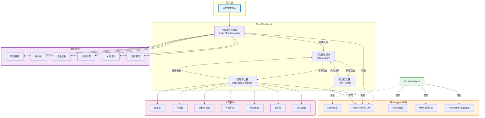

# CodePlanAgent

> 基于HelloAgents框架的智能代码计划工具

## 📝 项目简介

一个基于HelloAgents框架的智能代码计划工具 CodePlanAgent ，具备Reflection反思功能。

## 🕸️系统架构图



### 核心组件

1. **CodePlanAgent** - 核心智能体，负责代码计划的生成、反思和优化
2. **PlanGenerator** - 根据用户需求生成结构化的代码实现计划
3. **Reflector** - 对生成的计划进行多维度评估
4. **Refiner** - 根据反思反馈优化代码计划
5. **PlanMemory** - 存储计划生成轨迹和反思记录

### 工作流程

1. 用户输入需求描述
2. PlanGenerator生成初始代码计划
3. Reflector对计划进行反思评估
4. 如果需要改进，Refiner优化计划
5. 重复步骤3-4，直到计划无需改进
6. 输出最终代码计划

## 🛠️ 技术栈

- HelloAgents框架

## 📖 创建的文件
### 1. code_plan_agent.py - 核心实现
核心功能：

- 代码计划生成 ：根据需求描述生成结构化的代码实现计划
- 自我反思 ：对生成的代码计划进行多维度质量评估
- 迭代优化 ：根据反思结果自动优化代码计划
- 支持工具调用 ：可选集成工具调用能力
- 流式执行 ：支持异步流式输出

反思维度：

- 完整性：计划是否覆盖所有核心需求
- 可行性：技术方案是否可行
- 架构合理性：模块划分是否合理
- 可维护性：代码结构是否清晰
- 性能考虑：是否存在性能优化空间
- 安全性：是否存在安全风险
- 测试覆盖：是否考虑了测试策略

输出格式：

```
## 项目概述
[项目目标和核心功能]

## 技术栈
- 语言、框架、数据库等

## 目录结构
[项目目录结构]

## 实现步骤
1. [步骤描述]
   - 实现要点
   - 文件路径
   - 预期输出
...

## 关键设计
## 注意事项
```

### 2. demo.py - 使用示例
演示如何使用CodePlanAgent生成代码计划，包含两个示例：

- 创建待办事项应用
- 创建用户认证系统
### 3. .env.example - 环境配置示例
包含常用LLM服务的配置模板（OpenAI、DeepSeek、Qwen、Kimi、Zhipu、Ollama）

## 🗄️ 使用方法
```python
from hello_agents.core.llm import HelloAgentsLLM
from code_plan_agent import create_code_plan_agent

# 初始化LLM
llm = HelloAgentsLLM(
    model="your-model",
    api_key="your-api-key",
    base_url="https://api.example.com/v1"
)

# 创建CodePlanAgent
agent = create_code_plan_agent(llm)

# 生成代码计划
requirements = """创建一个待办事项应用..."""
plan = agent.run(requirements)

print(plan)
```
## 📚 配置步骤
1. 安装依赖

   ```
   pip install -r requirements.txt
   ```

2. 复制 .env.example 为 .env

3. 配置LLM环境变量

4. 运行 demo.py 查看效果

## 🎯 项目亮点

- 智能生成结构化代码计划，支持自然语言需求
- Reflection机制7维度质量评估，迭代优化闭环
- 基于HelloAgents框架，支持流式输出与计划追溯
- 输出含技术栈、目录、步骤，可执行性强

## 📂 项目结构

```powershell
│  .env.example
│  code_plan_agent.py
│  demo.py
│  README.md
│  requirements.txt
│
├─memory
│  └─traces
│          trace-s-20260604-154913-a988.html
│          trace-s-20260604-154913-a988.jsonl
│
└─outputs
       todo_app_plan.md
```

## 📊 示例输出

```
## 项目概述
本项目旨在构建一个**高内聚、低耦合**的 Python Flask 待办事项（Todo）管理 API。基于评审反馈，我们修正了架构描述与实际目录的一致性，...

## 技术栈
- 语言：Python 3.9+
- 框架：Flask (Web 框架)
- 数据库：SQLite (开发/测试), PostgreSQL (生产推荐)
- ...

## 目录结构
（略）

## 实现步骤
1. **项目初始化与安全配置**
   - 实现要点：创建虚拟环境；安装依赖...
   - 文件路径：`requirements.txt`, `config.py`, `.env.example`
   - 预期输出：基础工程结构搭建完成，启动时自动加载安全配置，...

2. ...

## 关键设计
- **架构一致性 (Controller-Service-Model)**：修正了原计划中提及“Repository”但无对应目录的问题。Service 层直接封装 ORM 操作，...

## 注意事项
- **架构复杂度权衡**：本计划采用了企业级实践（Pydantic, Alembic, 分层），对于“简单 Todo"需求属于适度超前。若项目周期极短，...
```

## 🚧 未来改进

- [ ] 增强反思深度
- [ ] 支持多格式输出
- [ ] 集成代码生成
- [ ] 优化性能
- [ ] 增加团队协作能力

## 👤 作者

- GitHub: [@yangyousan123](https://github.com/yangyousan123)
- 项目链接：[CodePlanAgent](https://github.com/datawhalechina/Hello-Agents/tree/main/Co-creation-projects/yangyousan123-CodePlanAgent)

## 🙏 致谢

感谢Datawhale社区和Hello-Agents项目！

## 📄 许可证

本项目采用MIT许可证。