# Agent Self-Evolution：智能体自进化的四类闭环

## 引言：Agent 为什么需要自进化？

在前面的章节中，我们已经学习了 ReAct、Reflection、MCP、Agent Skills、记忆系统、上下文工程和 Agentic RL。把这些能力放在一起看，一个很自然的问题会出现：如果智能体每次都从相似的错误中重新摸索，每次都重新查同一份资料，每次都重新写同一套操作步骤，那么它其实还没有真正"成长"。

**Agent Self-Evolution** 讨论的正是这个问题：智能体能不能把交互轨迹、任务反馈、用户纠正、工具执行结果、群体经验等信号沉淀下来，并让这些沉淀持续影响之后的行为？

这里的"自进化"不等于简单的长期记忆，也不等于手动安装一个插件。一个更实用的定义是：

> 自进化 Agent 是一种能够依据自身交互轨迹、任务反馈或环境信号，对上下文、记忆、技能、工具、工作流、代码或模型参数进行持续更新，并让这些更新影响未来任务表现的智能体系统。

这一定义有三个关键点。

1. **经验驱动**：更新来自真实任务、执行反馈、用户纠错、评测结果或环境信号，而不是一次性人工配置。
2. **持续生效**：更新会进入记忆、技能库、工作流、代码或参数中，在未来任务继续发挥作用。
3. **可评估、可回滚**：越强的自进化越需要评估器、版本记录、沙箱、权限控制和回滚机制。

本章按照"演化闭环放在哪里、演化对象是什么"来组织内容，分成四类：**内建上下文闭环**、**技能资产化闭环**、**外部监督或群体智能闭环**、**参数、代码或工作流自修改闭环**。每一类选取若干代表方法或技术，**共 10 个项目**。

<div align="center">
  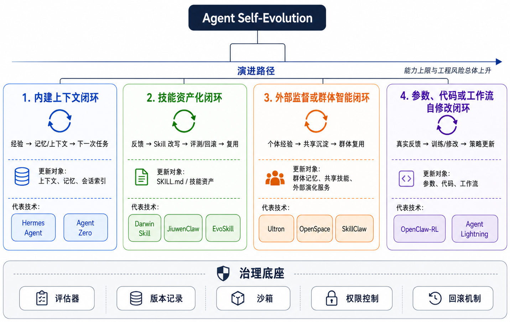
  <p><strong>图 1</strong> Agent Self-Evolution：四类闭环与 10 个代表项目。横切约束：任意演进路径都必须压在评估、版本、回滚、权限与供应链治理之上。</p>
</div>

## 四类闭环总览

先用一张表建立全局视角。这个表可以帮助大家快速判断：一个自进化系统到底在改什么、靠什么反馈改、改完之后如何影响下一次任务。


| 类型             | 代表方法或技术                                                                                                                                                                   | 要点速览                                                                                                     |
| -------------- | ------------------------------------------------------------------------------------------------------------------------------------------------------------------------- | -------------------------------------------------------------------------------------------------------- |
| 内建上下文闭环        | 1. [Hermes Agent](https://github.com/NousResearch/hermes-agent) <br>2. [Agent Zero](https://github.com/agent0ai/agent-zero)                                                         | 1. Hermes 把记忆、会话检索和技能创建放进 Agent 本体。 <br>2. Agent Zero 通过项目、聊天历史、工具和子智能体形成持续上下文。                              |
| 技能资产化闭环        | 1. [Darwin Skill](https://github.com/alchaincyf/darwin-skill) <br>2. [JiuwenClaw](https://github.com/openJiuwen-ai/jiuwenclaw) <br>3. [EvoSkill](https://github.com/sentient-agi/EvoSkill) | 1. Darwin Skill 把 SKILL.md 当作可评测、可回滚的资产。 <br>2. JiuwenClaw 在运行时根据反馈优化 Skill。 <br>3. EvoSkill 从失败轨迹中生成、测试和保留技能变体。 |
| 外部监督或群体智能闭环    | 1. [Ultron](https://github.com/modelscope/ultron) <br>2. [OpenSpace](https://github.com/HKUDS/OpenSpace) <br>3. [SkillClaw](https://github.com/AMAP-ML/SkillClaw)                          | 1. Ultron 把个人经验蒸馏为群体记忆、技能和 Harness。 <br>2. OpenSpace 作为外部演化服务维护技能版本谱系。 <br>3. SkillClaw 把跨会话、跨设备、跨用户经验合并为共享技能。   |
| 参数、代码或工作流自修改闭环 | 1. [OpenClaw-RL](https://github.com/Gen-Verse/OpenClaw-RL) <br>2. [Agent Lightning](https://github.com/microsoft/agent-lightning)                                                   | 1. OpenClaw-RL 把真实对话反馈转为异步 RL/OPD 信号。 <br>2. Agent Lightning 解耦 Agent 执行与 RL 训练。                             |


这四类从上到下，通常意味着能力上限越来越高，工程风险也越来越高。上下文和技能层的演化最容易审计和回滚；群体智能层开始涉及共享存储、权限和隐私；参数、代码或工作流层的自修改最接近"策略变了"，但也最依赖可靠评测器和隔离执行环境。

## 一、内建上下文闭环：让 Agent 在自己的主循环里学习

内建上下文闭环的核心思想是：不直接修改模型参数，而是让 Agent 把经验写入记忆、反思文本、会话索引或技能目录，在下一次任务中重新取用。

这类系统的优点是轻量、部署快、解释性强。它们不需要训练集群，也不需要复杂的在线 RL 基础设施。缺点也很明确：如果底层模型能力不足，单靠上下文和记忆很难突破上限；如果没有治理机制，错误记忆和错误反思也会持续污染后续行为。

### 1. Hermes Agent：把学习闭环做进 Agent 本体

项目地址：[https://github.com/NousResearch/hermes-agent](https://github.com/NousResearch/hermes-agent)

Hermes Agent 是这一类中最值得单独展开的工程项目。它面向 [self-improving AI agent](https://hermes-agent.nousresearch.com/docs) 这条路线：强项不在于某一个单项功能，而在于把多种「会在使用过程中变硬」的机制塞进同一个对话主循环。典型的几块拼图包括：由 Agent 主动维护的持久记忆（`MEMORY.md` / `USER.md` 等）、按需触发的跨会话检索（SQLite + FTS5，配合摘要）、技能的渐进加载与在使用中被创建或改写，以及安全面上的命令审批与多后端终端隔离等。

<div align="center">
  
  <p><strong>图 2</strong> Hermes Agent</p>
</div>

可以把 Hermes 的自进化想象成一条贴紧主循环的轻量闭环：**用户任务 → Hermes 主循环 → 工具 / 终端 / 消息网关 → 执行反馈与用户纠正**，产出分叉写入 **策展记忆** 与 **Skills**；记忆经 **session_search** 与技能一并汇入 **下一轮上下文**，再回到主循环。

这条路线的意义在于，「学习」发生在日常真实调用路径上。例如一次复杂排错结束后，Agent 可以把命令习惯、环境约束、失败原因和最终修复路径写进记忆或技能；以后再遇到同类问题时，不必从零试探整片搜索空间。

不过，Hermes 的主要更新对象仍然是**上下文、记忆和技能**，不是在线更新模型权重。因此它更适合被看作"内建上下文闭环的成熟工程形态"，而不是权重层自训练系统。

### 2. Agent Zero：把项目记忆、动态工具和子智能体放进主循环

项目地址：[https://github.com/agent0ai/agent-zero](https://github.com/agent0ai/agent-zero)  

Agent Zero 适合归入**内建上下文闭环**。它面向真实任务的 **[dynamic, organic agentic framework](https://github.com/agent0ai/agent-zero)**：**不把 Agent 做成单一用途脚本**，而是给它可用的操作系统级环境（终端、代码执行、文件、浏览器自动化等），并允许在任务演进过程中**按需创建或改写工具**。这与离线微调权重无关，更像「工作台状态」随着项目和会话不断累积。

工程上有几件与闭环直接相关的积木：**Project** 隔离工作区、说明、记忆、密钥、知识库、仓库与模型预设，可把仓库克隆进独立项目上下文；**Skills** 遵循开放的 `SKILL.md` 约定，可按全局、项目或当前会话启用；**Agent Profiles** 用来切换行为、提示覆盖、工具链与模型配置而无需重写整套系统；协作面则强调上级 Agent 创建 **subordinate agents**，由下属各自守住更小上下文并回报结果。它还支持 MCP、插件与可检视的 `prompts/`、`tools/` 布局，Web UI 侧还有 Universal Canvas、浏览器注解等面向人机共演的可视化能力（详见官方文档）。

<div align="center">
  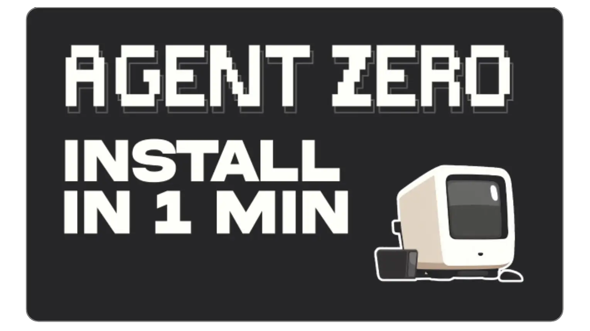
  <p><strong>图 3</strong> Agent Zero</p>
</div>

在同一视角下，主干回流可以压成一条链：**任务与目标 → Project → Chat → Skills / MCP / 插件 → 从属智能体 → 反馈与产出 → Project**（画布、浏览器注解等产品能力此处从略）。

Agent Zero 与 Hermes 的档位相近：二者都是「随使用加厚上下文」的个人或团队侧 Agent 宿主，而不是单一论文算法。Agent Zero 还交叉带有技能资产化（`SKILL.md`）与多智能体分工色彩，但本章仍把它的主标签落在内建上下文闭环上，因为最容易审计的增长首先发生在项目边界、会话状态、工具配置与实际执行痕迹之中。

## 二、技能资产化闭环：让经验沉淀为可复用 Skill

技能资产化闭环的核心思想是：把经验外显成可读、可版本化、可测试、可迁移的技能资产。

在 Agent Skills 生态里，`SKILL.md` 不只是一个说明文件，它可以成为 Agent 的程序性记忆：什么时候使用、如何执行、调用哪些脚本、遵守哪些约束、如何处理异常。技能层自进化的关键，就是让这些技能不再只靠人工维护，而是能被评估、改写、验证和回滚。

### 3. Darwin Skill：用评测和 ratchet 机制优化 Skill

项目地址：[https://github.com/alchaincyf/darwin-skill](https://github.com/alchaincyf/darwin-skill)

下面从 Darwin Skill 切入第二类闭环：`SKILL.md` 被明确当成可被度量、被迭代的资产。Darwin Skill 面向 SKILL 优化的主张可以概括为「**像训练模型一样优化你的 Agent Skills**」，方法论直接对齐 Karpathy 的 [autoresearch](https://github.com/karpathy/autoresearch)：用可量化目标驱动改动，并用 **棘轮（ratchet）** 只保留可验证的增益，其余 **git revert** 掉，避免基线随时间悄悄变差。

机制上拆成几条硬原则：**单一可编辑资产**（一次只改一个待优化的 `SKILL.md`）、**双重评估**（结构侧偏静态分析，效果侧要在测试提示上跑起来看输出）、**独立评分**（用子 Agent 打分，减轻「自改自评」）、**人在回路**（阶段之间暂停，展示 diff 与分数变化后再继续）。效果验证侧会用到诸如 `test-prompts.json` 一类的测试集；总分 100 来自 **八维 rubric**，其中结构维度与效果维度分值配比写得很清楚（效果里「实测表现」权重最高）。

<div align="center">
  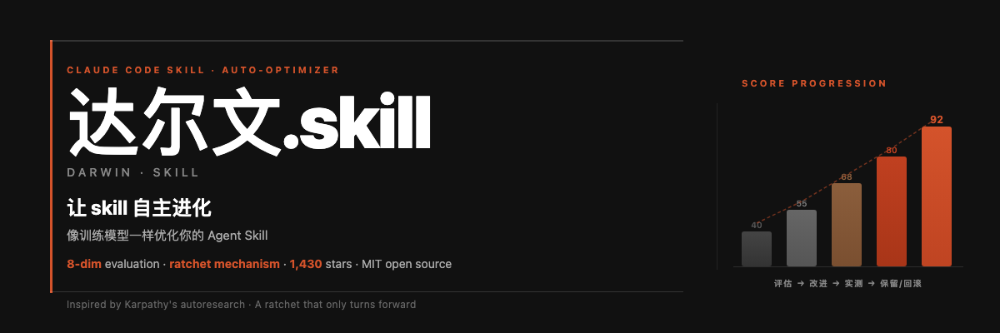
  <p><strong>图 4</strong> Darwin Skill</p>
</div>

下图与其 **Core Loop** 一致，对应 Evaluate → Improve → Validate → Confirm → Keep or Revert。

<div align="center">
  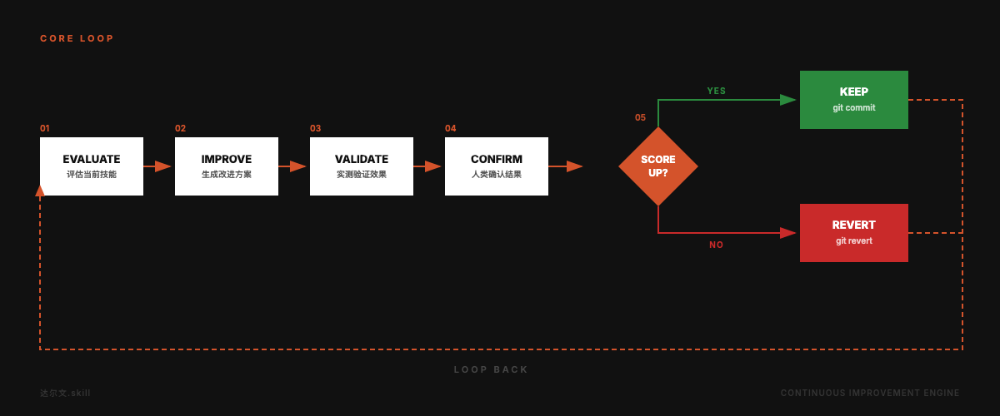
  <p><strong>图 5</strong> Darwin Skill：Evaluate → Improve → Validate → Confirm → Keep or Revert 闭环</p>
</div>

这套流程可以拆成五步：

1. **Evaluate**：对目标 `SKILL.md` 做结构分析与效果验证，汇总为八维加权分。
2. **Improve**：找出得分最低的维度，生成一轮针对性改写并提交改动。
3. **Validate**：在测试提示集（如 `test-prompts.json`）或等价真实任务上复测。
4. **Confirm**：展示 diff 与分数变化，由人确认是否进入下一轮或下一个 Skill。
5. **Keep or Revert**：新总分高于当前最优则保留，否则回滚；棘轮保证有效基线单调不降。

八维 rubric 把总分拆到多个维度（结构侧与效果侧分值配比见示意图）；「实测表现」在效果维度里权重最高。

<div align="center">
  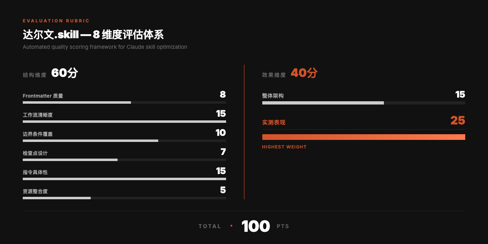
  <p><strong>图 6</strong> Darwin Skill：八维评分体系（总分 100）</p>
</div>

Darwin Skill 最重要的设计不是「自动改技能」，而是**只让可验证的改进留下来**。凡兼容开放 **Agent Skill / `SKILL.md`** 宿主的工具链都可接入，包括 Claude Code、Codex、OpenClaw、Trae、CodeBuddy 等；Darwin Skill 在其中扮演相对独立的技能优化器角色。

### 4. JiuwenClaw：运行时技能自演化

项目地址：[https://github.com/openJiuwen-ai/jiuwenclaw](https://github.com/openJiuwen-ai/jiuwenclaw)  
技能自演化文档：[https://github.com/openJiuwen-ai/jiuwenclaw/blob/develop/docs/en/SkillSelfEvolution.md](https://github.com/openJiuwen-ai/jiuwenclaw/blob/develop/docs/en/SkillSelfEvolution.md)

JiuwenClaw 面向长期陪伴式使用的标语是「Understands You. Evolves With You」：**Autonomous Evolution** 即在不满或执行出错时依反馈持续改进相关技能。实现上依靠 **SkillCallOperator** 统领读写与合并，连同 **SignalDetector**（基于规则、**不调用 LLM**）监视工具结果与用户措辞里的纠错线索；可归因到当前技能的事件交给 **SkillEvolutionManager** 编排扫描与生成，**SkillOptimizer** 在需要改动时调用 LLM 写出演进条目，先入 **`evolutions.json`**，再在合适时机 **solidify** 合并回 **`SKILL.md`**，也可通过 **`/evolve`** 手动触发。失败类信号偏向写入 **Troubleshooting** 一类小节，用户纠正则更常被整理成 **Examples**。每条技能在 workspace 下自有目录（典型路径形如 `~/.jiuwenclaw/workspace/agent/skills/<skill_name>/`），配置里可开启 **`evolution_auto_scan`**，工具回合结束后也可能在后台追加演进记录。

从分类上看，它仍然最适合归入**技能资产化闭环**：持久增量落在 `SKILL.md` 与 `evolutions.json`，而不是一次性的对话摘要。

<div align="center">
  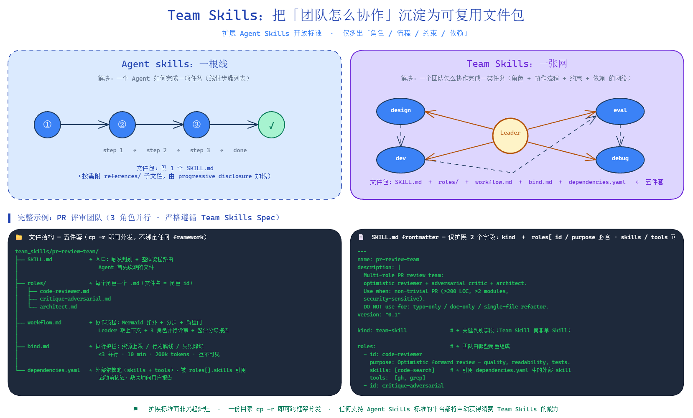
  <p><strong>图 7</strong> JiuwenClaw：项目概览与运行时技能自演化语境</p>
</div>

与仓库文档中的 **Evolution flow** 对齐的一条流水线：**用户对话或工具执行 → SignalDetector → SkillEvolutionManager → SkillOptimizer → `evolutions.json` → solidify → SkillCallOperator**（后者统一读写并在下一轮调用前加载合并后的 **`SKILL.md`**）。

与 Darwin Skill 相比：Darwin 更强调「像训练模型一样」的全套评测、八维打分、棘轮与强人在回路；JiuwenClaw 把演进嵌在日常会话与工具回路里，信号驱动、条目先入 JSON 再固化进文档，工程侧重点在**在线可用性与快速迭代**。它也免不了与**内建上下文闭环**交叉（同一轮对话里就要检测反馈），但本章仍以技能资产为主标签，因为可审计的长期增量主要在技能文件与演进记录里。

### 5. EvoSkill：从失败轨迹中演化技能变体

项目地址：[https://github.com/sentient-agi/EvoSkill](https://github.com/sentient-agi/EvoSkill)  
论文地址：[https://arxiv.org/abs/2603.02766](https://arxiv.org/abs/2603.02766)

EvoSkill 面向 **coding agent** 的自动技能发现与改进：在仓库语境里，它把 [GEPA](https://github.com/sentient-agi/gepa-plus) 那种「靠反馈改一处 prompt」的思路，扩展成对 **整套 agent program** 的迭代（可同时提议多条 **skill** 与 **system prompt** 变异），在 **留出验证集** 上打分，每一轮优秀候选会以 **全新程序状态** 进入下一轮，而不是只在原地补丁一段话。

自助回路在文档里被拆成五段：**Base Agent** 用当前最优配置跑基准里的样本；**Proposer** 对照失败样例提出针对性改动；**Generator** 写出新的技能文件或改写系统提示；**Evaluator** 在 held-out 数据上给新版本打分；**Frontier** 维护表现最好的 Top-N 套程序，并以 **`program/*`** Git 分支形式版本化（另有 **`frontier/*`** 标签标记前沿成员），便于 `evoskill diff`、`evoskill skills` 审计与回滚。工程上通过 **`evoskill init`** / **`evoskill run`** 驱动，数据集多为带标准答案的 CSV，可按任务写 `.evoskill/task.md`，执行模式支持本机、Docker 或 Daytona 远程沙箱；宿主 harness 覆盖 Claude Code、OpenCode、OpenHands、Goose、Codex CLI 等。演进配置里可选 **`skill_only`** 或 **`prompt_only`**，打分支持规则匹配、LLM-as-judge、脚本等多种 **scorer**。

<div align="center">
  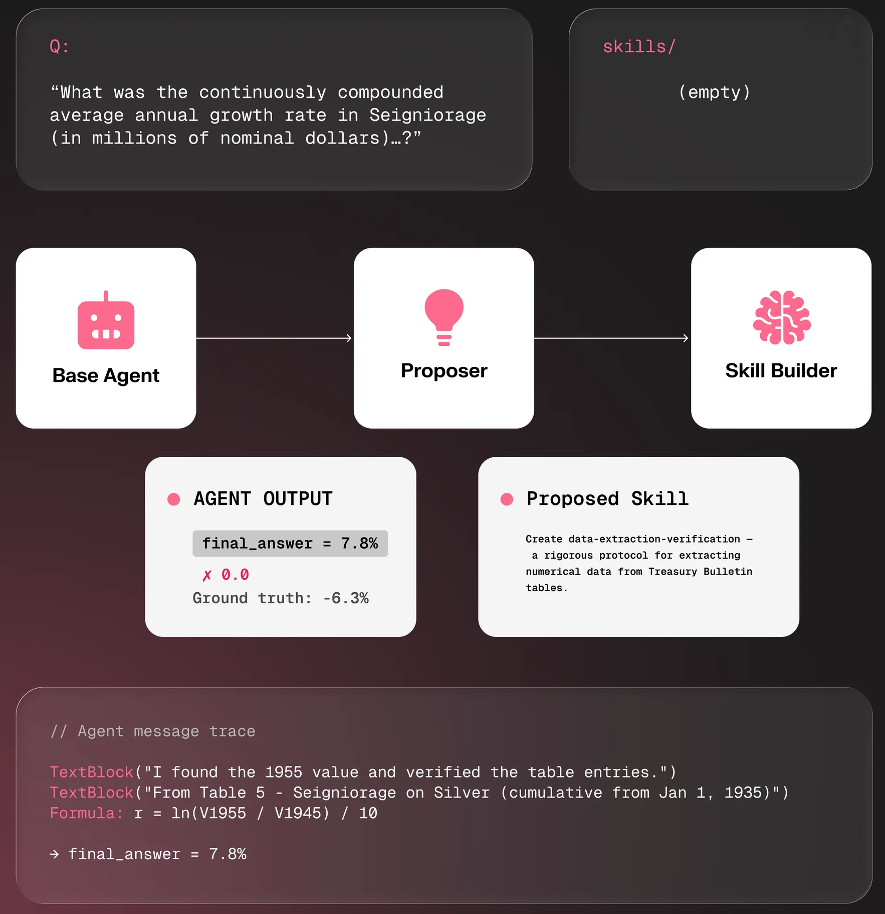
  <p><strong>图 8</strong> EvoSkill：面向编码 Agent 的技能与提示协同演进框架</p>
</div>

与 Darwin Skill 侧重「单一 SKILL.md + 八维棘轮」、JiuwenClaw 侧重在线会话信号不同，EvoSkill 更贴近 **离线基准驱动** 的「整包 Agent 配置进化」：成败证据来自可重复评测，产出是可拷贝的 skills 目录与 `program.yaml` 一类制品，适合要把编码助手从通用模型收成 **专精流水线** 的团队。

## 三、外部监督或群体智能闭环：让经验跨 Agent 流动

前两类闭环更多服务于单个 Agent。到了外部监督或群体智能闭环，经验开始跨会话、跨设备、跨用户、跨 Agent 流动。

这类系统的价值很直接：一个 Agent 已经踩过的坑，不应该让所有 Agent 再踩一遍；一个团队已经验证过的工作流，不应该只躺在某个人的本地历史里。它的代价也很直接：共享经验需要权限、脱敏、版本治理、质量门控和审计。

### 6. Ultron 群体智能：Memory Hub、Skill Hub、Harness Hub

项目地址：[https://github.com/modelscope/ultron](https://github.com/modelscope/ultron)  
展示地址：[https://writtingforfun-ultron.ms.show/dashboard](https://writtingforfun-ultron.ms.show/dashboard)

Ultron 是面向通用 Agent 的 **self-evolving collective intelligence**：把散落在各次会话里的经验蒸馏成**易于检索与复用的群体知识**。对外突出的三件能力是：**分层群体记忆**、**可随证据自我演进的群体技能**、**可分享的 Harness 蓝图**（一键导入整套人设、记忆与技能组合）。服务端 **Trajectory Hub** 承接 `.jsonl` 轨迹：任务分段、`ms_agent.trajectory` 指标、增量指纹去重与后台抽取；高质量轨迹还可用于 **SFT / 自训练**（可与 [Twinkle](https://github.com/modelscope/twinkle) Workbench 等训练框架衔接），从而在路由侧**压低终端模型调用成本**。这是一条「轨迹入库 → 记忆与技能生长 → 蓝图分发 → 更多轨迹回流」的长期闭环，而不是单靠堆长提示。

下文按 Memory Hub、Skill Hub、Harness Hub 三块控制台能力拆开叙述；整体仍落在第三类闭环：经验离开单机会话，进入可治理的共享层。

<div align="center">
  
  <p><strong>图 9</strong> Ultron：群体记忆、群体技能与共享 Harness</p>
</div>

**Memory Hub** 承担群体侧的「可召回事实库」。能力要点包括：**HOT / WARM / COLD** 分层并按命中次数再平衡、向量语义检索配合层级加权、**L0 / L1 / Full** 摘要层级（检索先返回短摘要以省 token，按需拉全文）、上传时的类型自动归类、近重复向量合并与批量整理、意图扩展检索 query、按时间的指数热度衰减，以及基于 **Presidio** 的中英 **PII** 检测与脱敏后入库。下图对应控制台里「浏览与检索分层记忆」这一视角。

<div align="center">
  
  <p><strong>图 10</strong> Ultron Memory Hub：分层群体记忆的浏览与检索</p>
</div>

**Skill Hub** 一侧既有从热点记忆**蒸馏**出的内部技能包，也对接 **ModelScope Skill Hub** 等外部索引做统一发现。**Skill self-evolution** 路径强调：相关记忆先形成语义簇，再**结晶**为多步工作流技能，证据累积后**再结晶**；配合 **provenance-grounded verification** 与 **structure-score upgrade gate**，避免演进后的技能在结构分数上**回退**。其与 [SkillClaw](https://github.com/AMAP-ML/SkillClaw) 等群体技能演进思路也存在承接关系，可与本章后文 SkillClaw 小节对照阅读。

<div align="center">
  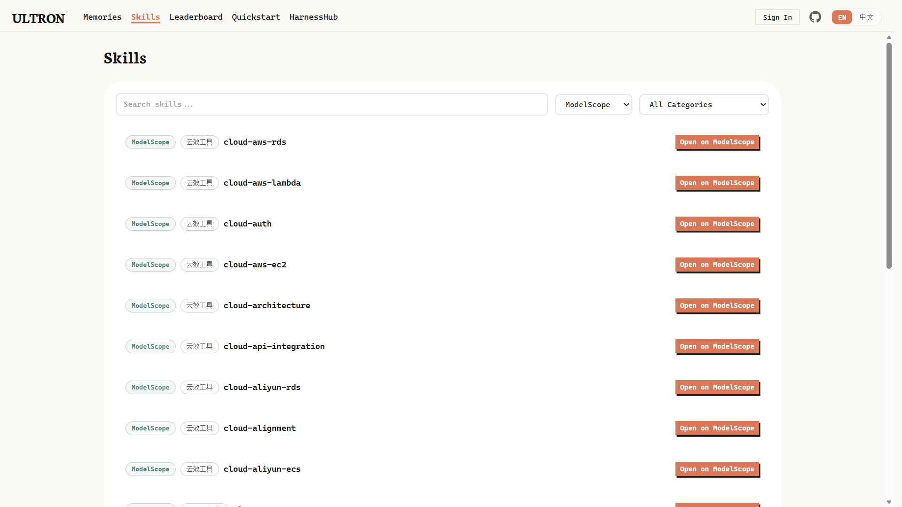
  <p><strong>图 11</strong> Ultron Skill Hub：内部蒸馏技能与外部索引技能的统一入口</p>
</div>

**Harness Hub** 把「用完即弃的会话人设」变成可版本化的资产：可发布完整 **Agent profile**（人设、记忆、技能一体）为短码可导入的蓝图，并支持工作区与服务器的**双向同步**以利多设备延续。它还提供大量 **Soul presets**（角色、MBTI、星座等组合）用于拼装 workspace 资源。下图对应控制台里组合与发布 Harness 的语境。

<div align="center">
  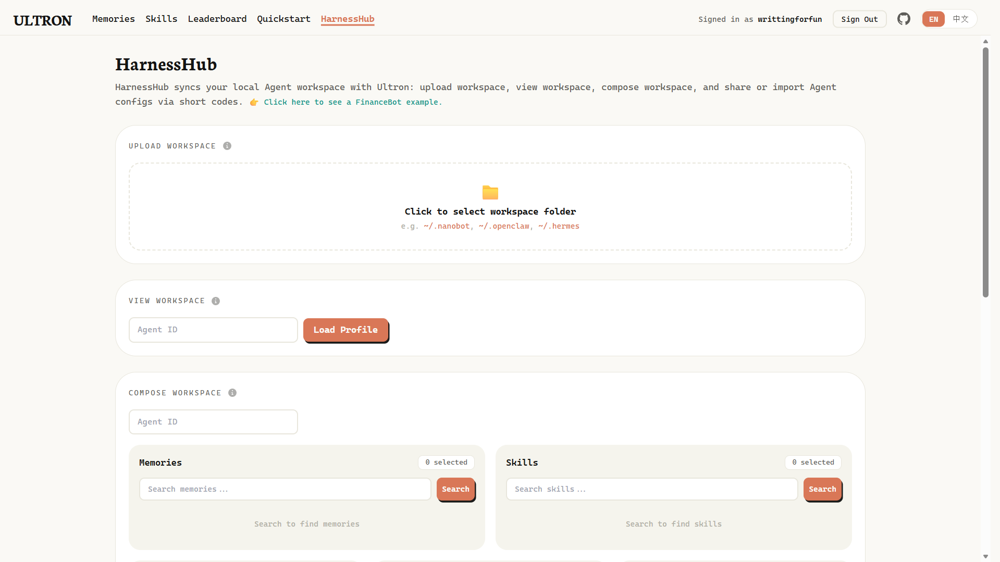
  <p><strong>图 12</strong> Ultron Harness Hub：组合人设与记忆技能并发布可导入蓝图</p>
</div>

接入侧主要面向「已有 Ultron 服务实例、只需把宿主 Agent 接上」的开发者；Showcase 中给出了面向 OpenClaw、Hermes、Nanobot 等的一键导入脚本。**Darwin Skill** 一类偏重单机 SKILL 资产审计与棘轮的优化器，也可以与 Ultron 的共享记忆 / 技能层形成互补：前者守住改动可解释性，后者放大跨会话、跨实例的复用半径。

若把问题收窄成一句话：Ultron 试图缓解典型的三类 Session-bound 痛点（经验随会话消亡、重复踩坑成本随实例数放大、人设无法迁移）。它不是替代某一个 Agent 框架，而是在其上叠加一层**可检索、可演进、可分发**的群体基础设施。

### 7. OpenSpace：外部演化服务与版本谱系

项目地址：[https://github.com/HKUDS/OpenSpace](https://github.com/HKUDS/OpenSpace)

OpenSpace 面向「宿主 Agent + 外挂技能演进引擎」的形态：常见接入路径是把 **OpenSpace MCP** 配进 Claude Code、Codex、OpenClaw、nanobot、Cursor 等工具链，由 OpenSpace 一侧承担技能发现、执行监控与云端同步，并以 **self-evolving engine** 为产品叙事：**失败可触发修复，成功模式可沉淀，技能质量可持续度量**。

演进机制上将技能视为持续迭代对象，区分三条主线：**FIX**（就地修补过时或失效说明）、**DERIVED**（从父技能派生增强或专精变体）、**CAPTURED**（从一次成功执行里抽取全新可复用流程）。触发源包括任务结束后的 **Post-Execution Analysis**、工具成功率下滑时的 **Tool Degradation** 巡检，以及周期性扫健康指标的 **Metric Monitor**，从而形成「执行 → 证据 → 补丁或新技能版本」的闭环。改写策略偏向 **diff 级最小改动**，失败可自动重试；版本侧用 **DAG** 记录谱系与对比，本地 **Dashboard** 可浏览技能演化图与执行历史。云端注册表支持公开、团队或私有可见性，并与社区检索、一键导入衔接。

群体维度上，它与第三类闭环的叙事一致：**单个 Agent 的改进可经由共享注册表扩散到其他实例**，相当于把演化基础设施放在宿主之外，由多端复用同一套技能库与监控栈。

<div align="center">
  
  <p><strong>图 13</strong> OpenSpace：外部演化服务与版本谱系</p>
</div>

典型用法是多实例或多用户并行接入同一 OpenSpace 服务或同一云端技能池：轨迹与执行证据在引擎侧汇聚，技能版本按质量信号迭代并保留谱系，再通过 MCP 或 CLI 拉回各宿主，避免每个 Agent 独自维护一套脆弱的静态技能目录。

### 8. SkillClaw：让技能跨会话、跨设备、跨用户演化

项目地址：[https://github.com/AMAP-ML/SkillClaw](https://github.com/AMAP-ML/SkillClaw)  
论文：[https://arxiv.org/abs/2604.08377](https://arxiv.org/abs/2604.08377)

SkillClaw 面向 **collective skill evolution**：把真实会话里的用法沉淀成可复用的 **`SKILL.md`**，并在单用户的多次会话、多台设备、多个 Agent 实例直至团队成员之间共享同一条演进回路，强调自动演进、去重与跨会话质量校验（可按需配置 **PRM**）。宿主侧兼容 Hermes、OpenClaw、Codex、Claude Code、QwenPaw 及任意 OpenAI 兼容 API 等常见链路。

架构分成两部分：**Client Proxy** 是本地 API 代理，拦截 **`/v1/chat/completions`** 与 **`/v1/messages`**，在不打断对话节奏的前提下记录会话产物并维护本地技能库，单独启用即可完成接入。**Evolve Server**（`evolve_server`）可选：从共享存储读取会话数据，生成或改写技能再写回；演进引擎支持 **`workflow`**（固定的 Summarize → Aggregate → Execute 三阶段 LLM 流水线）与 **`agent`**（基于 OpenClaw 工作区的直接改技能）两种模式。客户端与服务端只通过同一套存储层相遇（**本地目录 / OSS / S3**），因此个人可先跑代理，再在单机或远端挂载演进服务；团队场景则让多台客户端指向同一存储并由一台演进服务统一消化轨迹。

同一用户多台机器上的 Hermes、或同一团队多名成员的宿主 Agent，可以把各自的会话写入共享存储后，由服务端合并、去重并把新版本技能分发回各实例，这正是第三类闭环里「跨会话、跨设备、跨用户」的典型落地形状。

<div align="center">
  
  <p><strong>图 14</strong> SkillClaw：Client Proxy、共享存储与 Evolve Server 的总体框架</p>
</div>

举例来说：家用环境积累的 React 排错片段、办公环境积累的 Kubernetes 运维片段、服务器上 OpenClaw 跑的日志分析片段，若缺少共享技能层会各自孤立；接入 SkillClaw 后，它们进入同一演进与校验闭环，再按需回流到不同宿主，避免 fleet 内重复支付相同的试错成本。

## 四、参数、代码或工作流自修改：让策略本身发生变化

最后一类是最强也最重的闭环：系统不只是改上下文、记忆或技能，而是开始改模型参数、Agent 代码、工作流拓扑或候选算法。

这类系统的上限很高，因为它可能真正改变策略本身；但风险也最大，因为一旦评估器有漏洞、奖励设计不合理、沙箱不充分，系统就可能学会"迎合评测"而不是真正变强。

### 9. OpenClaw-RL：从真实对话反馈到在线 RL

项目地址：[https://github.com/Gen-Verse/OpenClaw-RL](https://github.com/Gen-Verse/OpenClaw-RL)  
技术报告：[https://arxiv.org/abs/2603.10165](https://arxiv.org/abs/2603.10165)

OpenClaw-RL 在同一套栈里叠了两条主线：**Track 1（Personal Agent）** 把自托管策略模型嵌进 [OpenClaw](https://openclaw.ai)，对外保持 OpenAI 兼容 API，拦截在线多轮对话并把交互转成训练信号，Serving 与后台优化互不阻塞；**Track 2（General Agentic RL）** 则将异步 RL 基础设施扩展到终端、GUI、SWE、工具调用等更重环境，拉高并行 rollout 规模。

闭环按 README 拆成四条异步回路：**Agent serving**、**rollout collection**、**PRM / Judge evaluation**、**policy training**（含 **LoRA**）。Rollout 侧把对话消息分成可训练的 **main-line** 与 **side**，并把下一拍用户、环境或工具反馈当作自然的 **next-state**；Judge / PRM 异步打分，可按需多数表决后再入队。**Binary RL（GRPO）** 用过程奖励模型结合下一状态反馈产生逐步标量奖励；**OPD（On-Policy Distillation）** 用 hindsight 文本构造增强教师，以师生 log-probability gap 给出方向信号；另有二者融合的 **Combine / Hybrid** 配方。部署可选本地多卡、[Tinker](https://thinkingmachines.ai/tinker/)、[Fireworks AI](https://fireworks.ai/) 等；也可通过官方扩展把 RL 头接到自有 OpenClaw。

<div align="center">
  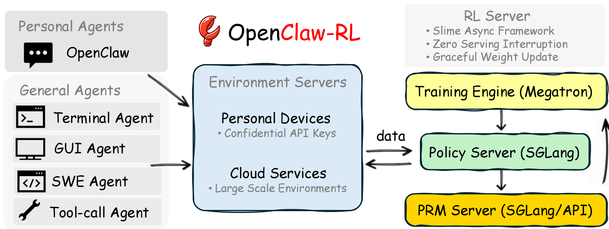
  <p><strong>图 15</strong> OpenClaw-RL：Serving · Rollout · PRM/Judge · Training 异步架构</p>
</div>

这类系统最接近「边聊边训」，但一旦真实用户反馈进入梯度路径，就必须并行落实知情同意、数据留存周期、隐私脱敏、奖励博弈与安全回滚；否则技术指标很容易被合规和法律风险抵消。

### 10. Agent Lightning：把 Agent 执行和 RL 训练解耦

项目地址：[https://github.com/microsoft/agent-lightning](https://github.com/microsoft/agent-lightning)  
论文：[https://arxiv.org/abs/2508.03680](https://arxiv.org/abs/2508.03680)  
文档：[https://microsoft.github.io/agent-lightning/](https://microsoft.github.io/agent-lightning/)

Agent Lightning 把训练链路收成三块：**Agent / Tracer** 侧只需最小侵入（显式 `agl.emit_xxx()` 或由 tracer 自动抓取 prompt、工具调用与奖励），事件规整为结构化 **span**；**LightningStore** 统一缓存任务定义、资源快照与轨迹，相当于训练侧的单一读写面；**Trainer + Algorithm** 读 span、产出更新后的资源（如精炼提示或策略权重），再回流推理端。算法槽位既可接 RL，也可接自动提示优化、监督微调等同一 span 契约。

官方文档强调可与 LangChain、OpenAI Agent SDK、AutoGen、CrewAI、Microsoft Agent Framework 等编排共存，也可用在无框架的裸 OpenAI 调用链上；多智能体场景里可 **选择性** 只对部分角色求梯度，而不必把整个拓扑改写成单一训练图。

<div align="center">
  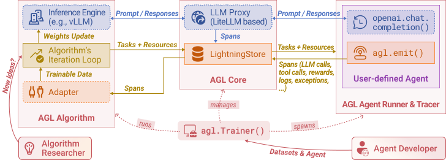
  <p><strong>图 16</strong> Agent Lightning：LightningStore 解耦在线执行与离线算法</p>
</div>

与 OpenClaw-RL 相比：前者紧贴 OpenClaw Serving + 异步 RL 训练栈；Agent Lightning 更像通用「轨迹公交」，目标是 **Trainer / Algorithm** 可插拔，宿主侧重保留原有框架语义。

## 自进化系统的关键工程问题

无论是哪一类闭环，真正落地时都会遇到四个共同问题。

### 1. 评估器比生成器更重要

自进化系统最危险的幻觉是："只要会自动改，就会自动变好。"事实恰好相反。没有评估器的自动修改，只是自动制造不确定性。

Darwin Skill 的 ratchet、SkillClaw 的验证 worker、Ultron 的结构评分升级门控、OpenClaw-RL 的 PRM/Judge、OpenSpace 的执行后分析与度量巡检，都说明了同一个道理：**自进化的核心不是改动，而是证明改动没有让系统变坏。**

### 2. 可回滚是自进化的基础设施

技能层的优势在于天然可版本化：`SKILL.md` 可以 diff，可以 git commit，可以回滚。相比之下，参数层更新虽然潜力更大，但解释和回滚更重。一个实用原则是：

```
能先在记忆层解决，就不要急着改技能；
能先在技能层解决，就不要急着改代码；
能先在代码/工作流层解决，就不要急着在线更新权重。
```

### 3. 共享经验需要治理

Ultron、OpenSpace、SkillClaw 都把个人经验放进共享层。共享会带来网络效应，也会带来污染风险。一个错误技能、一条带有隐私信息的记忆、一段被 prompt injection 污染的会话，如果进入共享库，就可能影响整个团队的 Agent。

因此，群体智能闭环至少需要四个默认能力：权限分层、PII 脱敏、候选验证、版本审计。

### 4. 技能供应链安全不能事后再补

Agent Skills 已经成为跨生态复用的能力封装格式。一个技能可以包含 `SKILL.md`、脚本、参考资料、模板、远程依赖和执行指令。它既像文档，又像软件包，还可能影响长期记忆和工具调用行为。

这意味着技能市场和技能共享不能只看"写得好不好"，还要看：是否读取敏感路径、是否执行危险命令、是否下载远程脚本、是否把 secret 写入输出、是否试图污染其他技能或记忆。

## 实践路线：从轻量闭环走向强自进化

如果你要在自己的 Agent 项目中引入 self-evolution，可以按四个阶段推进。

### 第一阶段：先做内建上下文闭环

目标是让 Agent 具备最基本的成长能力：会记录用户偏好、会总结失败经验、会检索历史会话、会把复杂任务沉淀为操作步骤。

可参考的项目是 [Hermes Agent](https://github.com/NousResearch/hermes-agent)。这一阶段的重点不是把历史无限塞回 prompt，而是让项目上下文、会话历史、工具状态和自引用信息逐渐形成稳定机制。

### 第二阶段：把经验沉淀为 Skill

当经验开始重复出现，就应该从记忆层提升到技能层。技能比记忆更结构化，也更容易迁移给其他 Agent。

可参考的项目是 [Darwin Skill](https://github.com/alchaincyf/darwin-skill)。如果你已经在使用 OpenClaw、Nanobot、Hermes、Codex 或 Claude Code 这类支持 `SKILL.md` 的宿主，技能资产化闭环通常是投入产出比最高的一步。

### 第三阶段：引入共享层和群体智能

当多个用户、多个设备、多个 Agent 都在积累经验时，就需要一个共享层来去重、验证、合并和分发。

可参考的项目包括 [Ultron](https://github.com/modelscope/ultron)、[OpenSpace](https://github.com/HKUDS/OpenSpace) 和 [SkillClaw](https://github.com/AMAP-ML/SkillClaw)。这一阶段要把隐私、权限和审计提前设计进去。

### 第四阶段：谨慎尝试参数、代码或工作流自修改

只有在评估器、沙箱、版本治理和回滚机制足够成熟之后，才适合尝试 [OpenClaw-RL](https://github.com/Gen-Verse/OpenClaw-RL)、[Agent Lightning](https://github.com/microsoft/agent-lightning) 一类把评测信号接到参数或结构化策略更新上的更重闭环。

如果你只是想让个人助手更懂你，可能不需要在线 RL；如果你要让 Agent 在大量真实任务中优化工具使用、GUI 操作、SWE 修复或工作流选择，那么参数或工作流层自修改才会逐渐变得必要。

## 总结

Agent Self-Evolution 并不是单一技术，而是一组从轻到重的闭环：

```
上下文/记忆自进化
  → 技能资产自进化
    → 群体经验自进化
      → 参数、代码或工作流自进化
```

**Hermes Agent** 与 **Agent Zero** 代表了内建上下文闭环：**Darwin Skill**、**JiuwenClaw**、**EvoSkill** 代表技能资产化闭环；**Ultron**、**OpenSpace**、**SkillClaw** 代表群体智能侧沉淀与分发；**OpenClaw-RL** 把在线交互接到 RL 或 OPD，**Agent Lightning** 则用 LightningStore 把执行观测与可插拔 Trainer 解耦。

对多数工程团队来说，最稳妥的路线不是一开始就做在线权重更新，而是先把"可解释、可评估、可回滚"的记忆与技能闭环做好。真正限制自进化落地的，往往不是模型不够聪明，而是评估、沙箱、权限、版本治理和供应链安全还不够扎实。

## 参考资料

[1] Hermes Agent. [https://github.com/NousResearch/hermes-agent](https://github.com/NousResearch/hermes-agent)  
[2] Agent Zero. [https://github.com/agent0ai/agent-zero](https://github.com/agent0ai/agent-zero)  
[3] Darwin Skill. [https://github.com/alchaincyf/darwin-skill](https://github.com/alchaincyf/darwin-skill)  
[4] JiuwenClaw. [https://github.com/openJiuwen-ai/jiuwenclaw](https://github.com/openJiuwen-ai/jiuwenclaw)  
[5] EvoSkill. [https://github.com/sentient-agi/EvoSkill](https://github.com/sentient-agi/EvoSkill)  
[6] Ultron. [https://github.com/modelscope/ultron](https://github.com/modelscope/ultron)  
[7] OpenSpace. [https://github.com/HKUDS/OpenSpace](https://github.com/HKUDS/OpenSpace)  
[8] SkillClaw. [https://github.com/AMAP-ML/SkillClaw](https://github.com/AMAP-ML/SkillClaw)  
[9] OpenClaw-RL. [https://github.com/Gen-Verse/OpenClaw-RL](https://github.com/Gen-Verse/OpenClaw-RL)  
[10] Agent Lightning. [https://github.com/microsoft/agent-lightning](https://github.com/microsoft/agent-lightning)
