# 旅行助手后训练实战：从产品协议到 SFT、DPO 与 Rerank 收尾

这个项目来自我维护的 `helloagents-trip-planner`。它不是论文项目，也不是为了刷榜。我把它当成一次工程练习：一个看起来会聊天的旅行助手，怎么一步步改到能接前后端、能被规则抓错、还能继续修。

旅行规划看起来简单，其实很会骗人。第一版 Demo 通常挺好看：用户说“我想去杭州玩 4 天，预算 3500”，模型很快就能写出景点、酒店、餐厅和注意事项。真接到前后端以后，麻烦就来了：预算是整趟还是人均，酒店按几晚算，门票要不要乘人数，餐厅是不是真的来自工具候选，最后一天到底还要不要安排晚餐。

这篇 Extra-Chapter 只写精简版：这条线怎么走过来，哪些尝试有用，哪些后来证明没必要。命令、配置和完整归档放在项目仓库里。

项目与配套材料：

- 旅行助手项目仓库：[helloagents-trip-planner](https://github.com/nameless0120/helloagents-trip-planner)
- 完整后训练教程：[旅行助手后训练实战教程](https://github.com/nameless0120/helloagents-trip-planner/blob/main/training/docs/%E6%95%99%E7%A8%8B/%E6%97%85%E8%A1%8C%E5%8A%A9%E6%89%8B%E5%90%8E%E8%AE%AD%E7%BB%83%E5%AE%9E%E6%88%98%E6%95%99%E7%A8%8B.md)
- 配套数据：`helloagents-后训练数据`，网盘链接：<https://pan.baidu.com/s/5oNsK7pwQnqzQEUg5ykb09Q>

跑到最后，我觉得路线其实很朴素：**Prompt 固定协议，SFT 学会结构，DPO 学偏好，Rerank 在候选里选更稳的答案。**

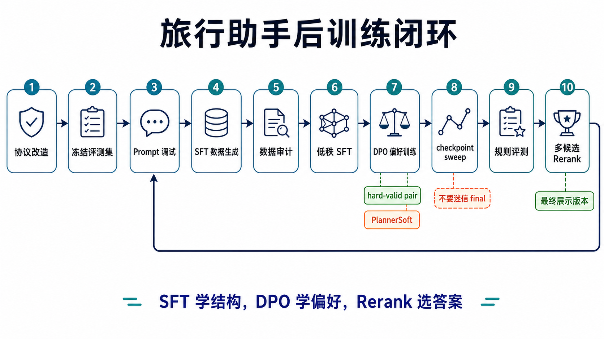

---

## 目录

- [第一章：先看一条前后对比](#第一章先看一条前后对比)
- [第二章：为什么不能一上来就训练](#第二章为什么不能一上来就训练)
- [第三章：先改产品协议](#第三章先改产品协议)
- [第四章：冻结评测集](#第四章冻结评测集)
- [第五章：Prompt 调试是在找边界](#第五章prompt-调试是在找边界)
- [第六章：SFT 数据生成和审计](#第六章sft-数据生成和审计)
- [第七章：LoRA SFT 多阶段训练](#第七章lora-sft-多阶段训练)
- [第七章补充：全参 SFT 为什么没成为主线](#第七章补充全参-sft-为什么没成为主线)
- [第八章：Best-of-N Replay 和 SFT Rerank](#第八章best-of-n-replay-和-sft-rerank)
- [第九章：DPO 学偏好，核心指标换成 PlannerSoft](#第九章dpo-学偏好核心指标换成-plannersoft)
- [第十章：最终多候选 Rerank](#第十章最终多候选-rerank)
- [第十一章：和 MiMo 外部参考怎么比](#第十一章和-mimo-外部参考怎么比)
- [Bad Case Gallery：三个最值钱的错误](#bad-case-gallery三个最值钱的错误)
- [第十二章：这次实验留下来的经验](#第十二章这次实验留下来的经验)
- [复现资源](#复现资源)

---

## 第一章：先看一条前后对比

先不讲 LoRA，不讲 DPO，也不讲 rerank。看一个普通请求：

> 一个人去杭州玩 4 天，打车，住经济型酒店，喜欢美食和城市地标，总预算 3500 元左右，而且不能超。

基础模型不是完全不会写。它能写出西湖、灵隐寺、城市阳台，也会给酒店和餐厅。但细看会发现不踏实：行程偏空，酒店天数不稳，餐厅重复，预算也离用户目标太远。它看起来像旅行计划，真的拿给用户就有点悬。

后训练后的版本也不是满分，比如餐饮预算还有一个 60 元的小账误差。但它至少开始像一个认真排过的行程：酒店晚数稳定，景点密度正常，餐厅不再一路重复，预算也更接近用户给的硬约束。

| 观察点 | 基础模型 | 后训练后 |
| --- | --- | --- |
| 行程密度 | 4 天基本每天 1 个景点，偏空 | 每天 2 到 3 个景点，覆盖西湖、断桥、雷峰塔、灵隐寺、西溪、清河坊等点位 |
| 酒店 | 前 3 天有酒店，第 4 天写成“无住宿”，预算里又按 4 晚算 | 前 3 晚稳定使用同一家经济型酒店，预算按 3 晚算 |
| 餐饮 | 肯德基重复较多，午晚餐轮换差 | 餐厅有轮换，包含杭帮菜、海鲜、烤肉、面馆和少量快餐 |
| 预算 | 报 1840 元，离 3500 元 hard budget 太远 | 报 2500 元，落在可接受区间下沿 |
| 规则评测 | 抓出 9 类错误 | 当前主要剩餐饮小账误差 |

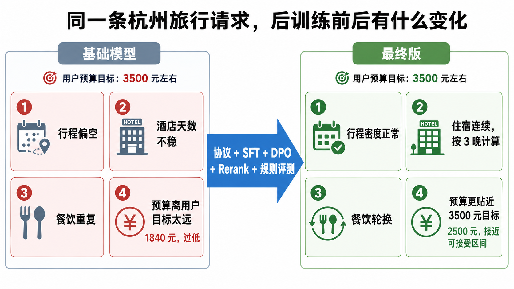

我想先把话说清楚：后训练不是为了让模型把文案写漂亮，而是让它更像一个能放进产品流程里的 Planner。住宿晚数、餐饮 grounding、预算关系、日期天气、输出 JSON，这些东西看着碎，但真实产品里最容易翻车的就是它们。

---

## 第二章：为什么不能一上来就训练

我一开始也很想直接训练。跑 LoRA 最有进度感：数据一准备，脚本一启动，loss 开始往下掉，看起来项目就在向前走。

后来发现这个顺序是反的。

如果业务事实没有固定，训练只会把混乱学得更稳定。用户说“预算 3000”，模型要知道这是整趟预算还是人均预算；酒店价格是单间每晚，不是全程总价；景点门票要乘同行人数；餐厅不能凭空编，最好来自工具候选。只靠 prompt 反复提醒，能救一部分，但救不了整条链路。

所以我后来没有按这条路走：

```text
写 prompt -> 造数据 -> 训练 -> 看指标
```

而是：

```text
前后端协议改造
  -> 冻结 standard / hard 评测集
  -> prompt 调试和失败画像
  -> 强模型生成 SFT 数据
  -> 数据审计与 LLaMA-Factory 导出
  -> LoRA SFT 多阶段训练
  -> Best-of-N Replay
  -> DPO 偏好训练
  -> 规则评测、切片对比和 checkpoint 选择
  -> 多候选 Rerank 收尾
```

慢是慢，但好处很实在：每一轮都知道自己在改什么，也知道哪里又被改坏了。

---

## 第三章：先改产品协议

刚开始做旅行助手时，我也很容易把问题都扔给模型：让它从自然语言里猜人数、猜预算口径、猜住宿晚数，再猜门票和餐厅价格。第一版能跑，但后面训练会很痛苦，因为训练数据里的“事实”本来就是飘的。

后来我做的第一个决定很朴素：**不要让模型猜业务事实。**

前端不再只提交一段自由文本，而是显式提交：

- `party`：成人、儿童、老人、总人数、出行类型；
- `budget_constraint`：金额、币种、预算范围、预算档位、约束强度；
- `travel_days`、交通方式、住宿偏好、兴趣偏好等结构化字段。

后端也不再把工具结果一股脑塞进 prompt，而是先编译成 `PlannerContext`。这个上下文会明确告诉模型：这次是几个人，预算是整趟还是人均，酒店按几晚计算，每个景点、餐厅、酒店候选来自哪里，价格 hint 和预算策略是什么，最后输出必须满足什么 JSON shape。

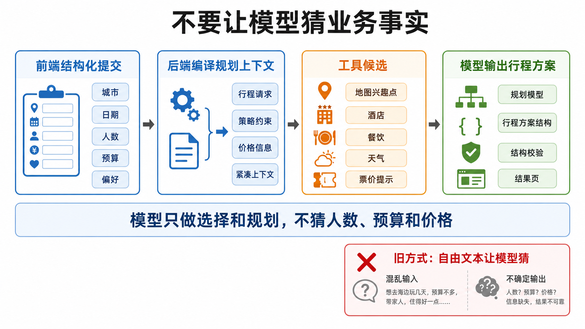

如果想顺代码看，可以按这条线索找：前端表单类型、后端请求 schema、PlannerContext 编译、输出解析和校验。具体文件路径放在 `helloagents-trip-planner` 的完整教程里，这里不展开。

有了这层协议，后训练的任务才变窄：模型不再凭感觉写旅行计划，而是在结构化候选里做选择，并输出合法 JSON。

---

## 第四章：冻结评测集

训练结果看不懂，很多时候不是模型的问题，是考卷一直在变。

旅行助手尤其容易这样：今天地图候选变了，明天天气变了，后天预算生成逻辑又变了。最后你分不清是模型变强，还是考卷变简单。

所以我先把评测集固定住。

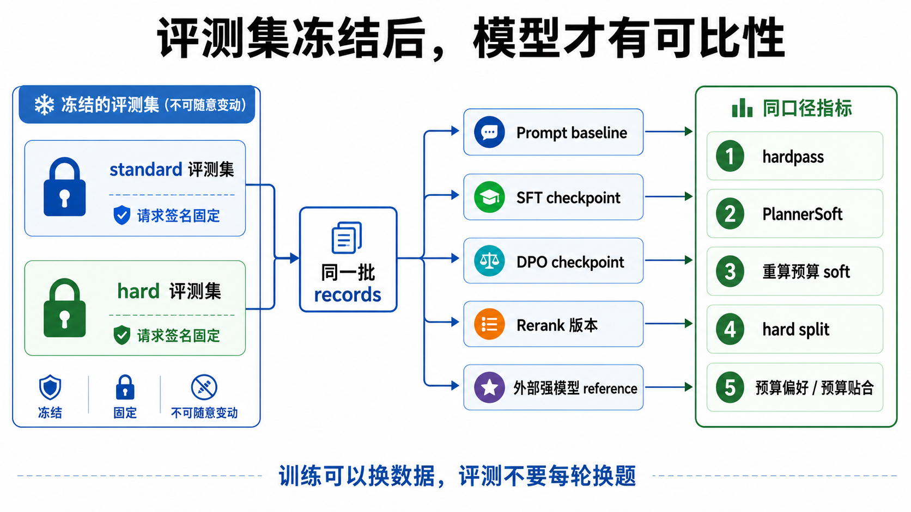

我把评测拆成两类：

| 评测集 | 作用 |
| --- | --- |
| `standard eval` | 看普通请求下的稳定性，比如常规城市、常规预算、常规偏好 |
| `hard eval` | 主动放大难点，比如多人、老人儿童、严格预算、负向偏好、特殊饮食 |

这里还有一个细节：后面检索策略和上下文修复变了，确实需要重建评测上下文，但不应该重新采样用户请求。我的做法是保持 request signature 不变，只重建工具候选和上下文。这样能保留可比性，又能修掉旧上下文里的脏数据。

这套 frozen eval 后来一直用来选模型。严格论文口径下，它更像 validation set，不是 blind test。所以我只把它叫“固定评测集上的阶段评估”，不包装成独立盲测。

最后做 DPO 收尾数据时，我专门检查过签名重叠：`selected_eval_signature_overlap = 0`。也就是说，评测 prompt 没有进入训练数据。

---

## 第五章：Prompt 调试是在找边界

前后端协议和评测集稳定后，才进入 prompt 调试。

这里我不是在找一条“神 prompt”。我更关心的是：哪些问题 prompt 能救，哪些问题必须交给数据、规则和工程。

前几轮 prompt 大概解决了三类问题：

| 轮次 | 主要目标 | 结论 |
| --- | --- | --- |
| 输出协议 | 日期不能乱、餐次不能缺、酒店字段不能飘、JSON 不能半截 | prompt 能明显提升 shape 稳定性，但还要配合 parser 和 validation |
| 餐饮 grounding | 餐厅必须来自候选，不写“附近小吃”“当地特色餐厅” | prompt 里写还不够，评测也必须能抓没 grounded 的输出 |
| 伪精确路线 | 不写工具没给过的“步行 10 分钟”“打车 15 分钟” | 这类 hallucination 更适合在输出规则里拦掉 |

这一步真正有用的不是 prompt 本身，而是失败画像。bad case 看多了，问题会自己分层：schema、日期、餐次缺失适合 shape validation；餐厅和景点不 grounded，要靠 prompt 和规则一起压；预算关系太复杂，最好拆成工程重算和模型选择两部分；偏好满足度不够，再去补数据。

Prompt 调到最后，最重要的不是再写长一点，而是知道该停在哪。

---

## 第六章：SFT 数据生成和审计

SFT 数据生成最容易让人放松警惕。

强模型确实能生成很像样的旅行计划，但“像样”不等于“能训练”。如果 teacher 输出里预算口径错、餐厅不 grounded、酒店每天乱换，学生模型会学得更稳定，也会更稳定地错。

所以我把数据生成拆开做：

1. 先 dry-run 请求分布，看城市、天数、预算、同行类型是否合理。
2. 再 dry-run `PlannerContext`，确认工具候选、价格 hint、天气和预算策略都能编译出来。
3. 小批量生成，先跑 20 到 100 条，不要一上来就生成上千条。
4. 每次强模型调用都记录 usage、manifest 和 run 配置。
5. 生成后先审计，再进入训练集。

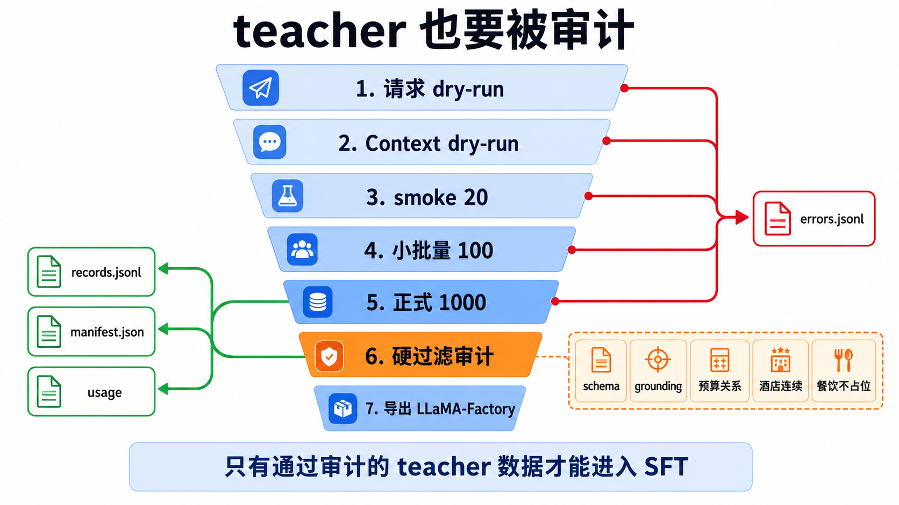

审计时先看硬过滤：

| 过滤项 | 为什么重要 |
| --- | --- |
| JSON / schema 合法 | 后端必须能解析 |
| 日期和天数一致 | 旅行计划不能少天、多天、错日期 |
| 酒店和餐厅 grounded | 不能凭空编候选 |
| 餐饮不重复 | 不能连续几顿同一家快餐 |
| 预算 hard constraint | 硬预算不能超 |
| 预算关系合理 | 酒店晚数、门票人数、餐饮尺度要对 |

还有一个容易忽略的点：旧数据不要舍不得。项目早期有一批旧 SFT 数据，局部看挺干净，但来自旧预算口径。后来我选择全量归档，不再修修补补继续用。这个决定当时有点痛，但回头看是对的。后训练最怕“新协议 + 旧口径数据”混在一起，模型表面学到了更多样本，实际学到的是互相冲突的规则。

---

## 第七章：LoRA SFT 多阶段训练

有了数据之后，才真正进入 LoRA SFT。

这条线使用 Qwen2.5-7B-Instruct 做 LoRA。训练不是一轮完成，而是多阶段推进。我的原则是：**尽量少同时改变量。**

底层设置基本保持稳定：LoRA r32、长上下文、bf16、梯度累积。这里最重要的不是把参数表背下来，而是明白为什么后面每一轮都只改一个主要变量。`PlannerContext` 里有景点、酒店、餐厅、天气和预算策略，压短上下文会直接截掉信号；rank 太小，长 JSON 协议和候选选择也学不稳。

真正反复调的是三类东西：数据、学习率、训练轮数。

| 阶段 | 起点 | 数据 | 主要参数 | 想解决什么 |
| --- | --- | --- | --- | --- |
| 主干 Clean SFT（main clean） | Qwen2.5-7B-Instruct | `main_clean` | `lr=8e-5 / 6e-5`，`epoch=4` | 先学稳 TripPlan 协议 |
| 真实预算混合补训（usage700） | 从 `lr6e-5` adapter 接着训 | main clean + realbudget usage700 | `lr=2e-5`，`epoch=1` | 补预算使用和真实预算口径 |
| 预算利用诊断补训（patch700） | 从 `lr6e-5` adapter 接着训 | budget utilization patch 700 | `lr=1e-5`，`epoch=2` | 看预算利用型补数到底能推多远 |
| SFT Rerank 回放 600（Best-of-N 600） | 从 usage700 adapter 接着训 | old replay + Best-of-N winner | `lr=1e-5`，半轮保存 | 注入规则筛出来的更好候选 |
| SFT Rerank 回放 1200（Best-of-N 1200） | 从 Best-of-N 600 final 接着训 | old replay + 更多 Best-of-N winner | `lr=1e-5`，半轮保存 | 增加 winner 占比，看是否继续提升 |

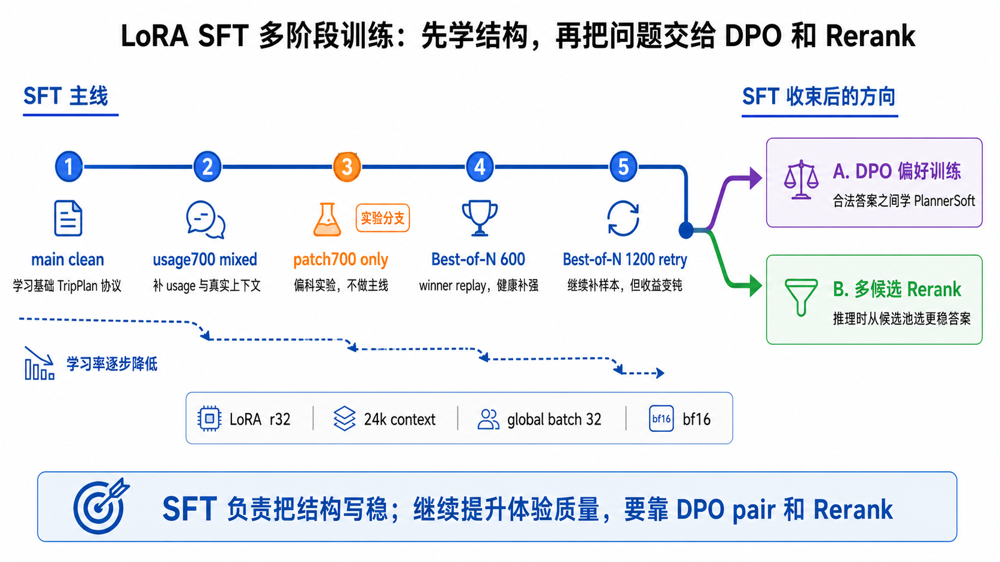

这里有个坑我踩过：`adapter_name_or_path` 不是 `resume_from_checkpoint`。它只是拿上一轮导出的 LoRA adapter 做 warm-start，优化器状态不会接着上一轮走。也就是说，每一阶段都会重新使用当前配置里的学习率和调度器。

这反而适合阶段实验。上一轮学到的能力留在 adapter 里，下一轮用更小的学习率继续修局部问题。

学习率一路往下降，也是这个原因：

```text
main clean:       6e-5 / 8e-5
usage700 mixed:   2e-5
patch700 only:    1e-5
Best-of-N replay: 1e-5
DPO closing:      1e-6 到 1.5e-6 级别
```

越往后，数据越像在修局部问题。学习率太高，预算指标可能上去了，餐饮 grounding、住宿连续性或者日期天气又掉下来。

### 第七章补充：全参 SFT 为什么没成为主线

LoRA 主线写完以后，我又补了一次全参 SFT。不是想推翻前面的路线，就是想看看上限：如果不只训 adapter，而是动全模型，旅行 Planner 会不会再涨一截？

这次用的是 `Qwen2.5-7B-Instruct` 和第一版 clean SFT 数据，保持长上下文，跑 6 epoch。训练能跑通，但成本马上就上来了：6 张 40GB 卡一炉大约 7 小时，保存出来的模型 28GB。和一个 LoRA adapter 比，这已经不是同一个迭代手感了。

结果挺有意思。全参不是没用，它确实把 planner soft 往上推了：

| 指标 | Full Instruct 全参 | LoRA 同版 | 差值 |
| --- | ---: | ---: | ---: |
| 硬通过 | 94.4% | 95.8% | -1.4pp |
| Planner Soft | 48.0% | 44.7% | +3.3pp |
| 重算预算 Soft | 33.8% | 30.7% | +3.1pp |
| 餐饮多样性 | 82.6% | 76.4% | +6.2pp |
| 预算偏好贴合 | 67.8% | 66.9% | +0.9pp |
| 预算合计一致 | 68.0% | 72.3% | -4.3pp |
| 用户预算约束 | 88.8% | 91.6% | -2.8pp |

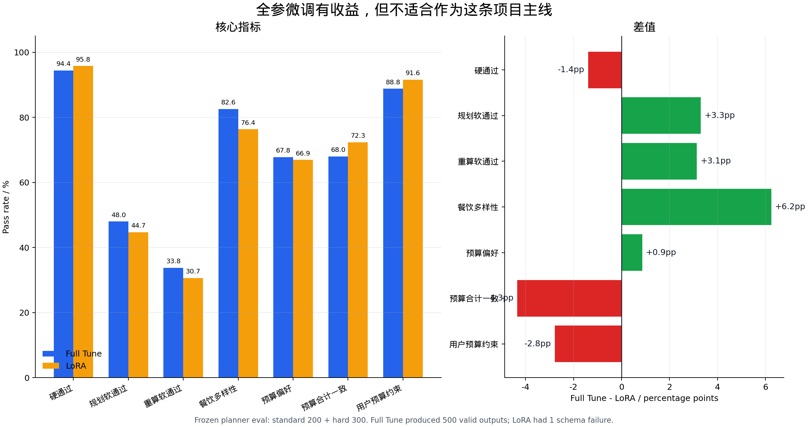

standard 集上，全参版本的 Planner Soft 从 48.0% 涨到 57.5%，这个提升很明显。它更愿意把行程写丰富，餐饮也没那么容易重复。换句话说，全参更新确实动到了模型的“规划习惯”，不是只在表面学格式。

但我最后还是没把全参放进主线。原因很简单：这个项目最难的不是让模型多写一点，而是让它在一堆硬约束里别算错。预算合计、用户预算、酒店晚数、景点门票按人数算，这些更像工程规则和数据分布问题。全参会让模型更灵活，但灵活不等于更稳。

对这个项目，我最后还是更愿意用 LoRA：

- 数据量是千级别，不是几十万条指令数据。全参容量太大，容易把局部风格也一起学进去。
- 任务重心是长上下文复制、schema 输出、候选 grounding 和预算规则。LoRA 已经能把这些压到很高水平。
- 迭代成本差太多。LoRA 训练、保存、回滚、评估都轻，全参每试一次都要认真排卡和清空间。
- 后面真正能涨分的地方，多半在数据清洗、bad case 挖掘、DPO pair 和 rerank。全参会拖慢这套节奏。

所以这次全参实验在教程里的位置很清楚：**它说明 Planner Soft 还有上升空间；也说明这个项目不能靠全参硬推。**

全参可以玩，尤其是想做一次漂亮的离线结果。但这个项目要反复补数据、跑评测、回滚对比，我还是会选 LoRA + DPO + Rerank。

---

## 第八章：Best-of-N Replay 和 SFT Rerank

SFT 学稳协议后，我先做 Best-of-N replay，再做最终展示阶段的 rerank。名字有点像，但它们不是一件事。

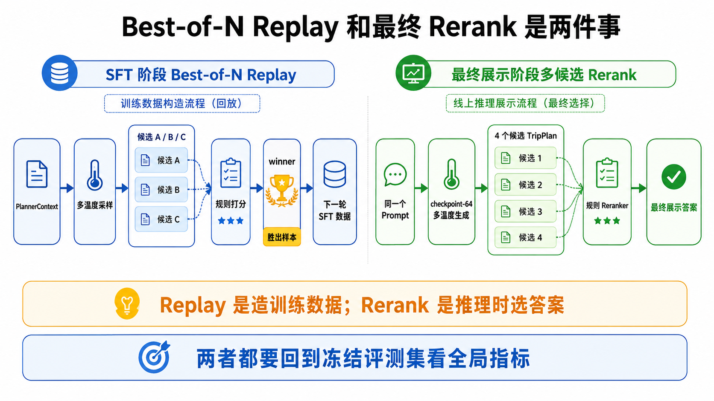

Best-of-N Replay 是训练数据构造流程：同一个 `PlannerContext`，让当前模型采样多个答案，用规则评估器挑一个更好的，再把 winner 导出成下一轮 SFT 数据。

```text
PlannerContext
  -> t=0.2 / 0.5 / 0.8 多温度采样
  -> 每个候选跑 rule metrics
  -> 优先选 hardpass 候选
  -> 再看预算、餐饮尺度、多样性等软奖励
  -> winner 进入下一轮 SFT
```

最终 Rerank 是推理时流程：同一个 prompt 生成多个候选，不再把 winner 写回训练集，而是在线上从候选池里选一个更稳的答案返回给用户。

这两个流程最后都要回到 frozen eval 上看。规则挑 winner 肯定有偏，如果 reward 太偏向某个指标，模型可能会变保守，也可能牺牲体验。只看单个 winner 的分数，很容易高兴早了。

SFT 阶段接入多温度候选 + 规则 rerank 后，几个版本整体上了一个台阶：

| 版本 | hardpass | softpass | 重算预算 softpass | 预算算术 | 预算偏好 | 预算关系 | 餐饮尺度 |
| --- | ---: | ---: | ---: | ---: | ---: | ---: | ---: |
| SFT 中期 checkpoint + rerank（ckpt104） | 98.0 | 65.6 | 54.6 | 81.2 | 77.0 | 86.4 | 88.8 |
| Best-of-N 1200 回放 + rerank（final1200） | 98.2 | 66.8 | 54.6 | 78.0 | 78.4 | 85.0 | 88.0 |
| Best-of-N 600 回放最终版 + rerank（old600final） | 98.2 | 66.2 | 59.2 | 78.4 | 75.4 | 87.0 | 89.4 |

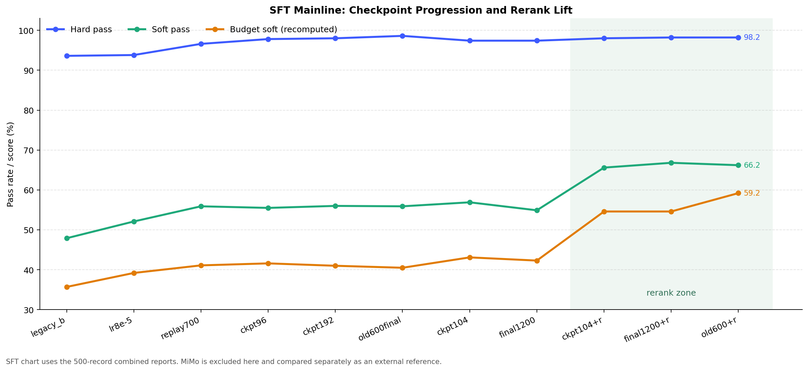

到这里，SFT 阶段可以收束。继续追加 SFT 的收益已经变钝，后面的主要增益应该来自偏好数据和候选选择。

---

## 第九章：DPO 学偏好，核心指标换成 PlannerSoft

SFT 已经能把 TripPlan 的壳子写稳，但合法答案之间也有好坏。两个计划都能过 schema，都能找到酒店和餐厅，一个可能很省但不像用户想要的旅行，另一个预算更贴合、餐饮更少重复、景点也更顺。

这种取舍很难靠单条 teacher 样本学稳，DPO 更顺手。

我没有把 DPO 当万能增强用。它在这里就做一件事：**在 hardpass 已经过关的候选里，学习哪个更像一个好行程。**

### DPO pair 先过硬门槛

DPO pair 的 chosen / rejected 不能乱来。坏 JSON 对好 JSON，这种 pair 对模型当然有信号，但它学到的是格式，不是偏好。这个项目里更有用的是下面这种 pair：

```text
同一个 PlannerContext
  -> chosen: schema 过、hardpass 过、planner soft 过
  -> rejected: schema 过、hardpass 过，但预算/重复/偏好没过
```

这样训出来的模型才是在合法计划之间学选择，而不是重新学怎么写 JSON。

还有一条底线：不能从冻结评测集里挖训练 pair。预算收尾数据里专门做了签名过滤：

```text
frozen eval signature count = 497
selected eval signature overlap = 0
```

这一步很烦，但省不了。不然分数看着好，其实是在背题。

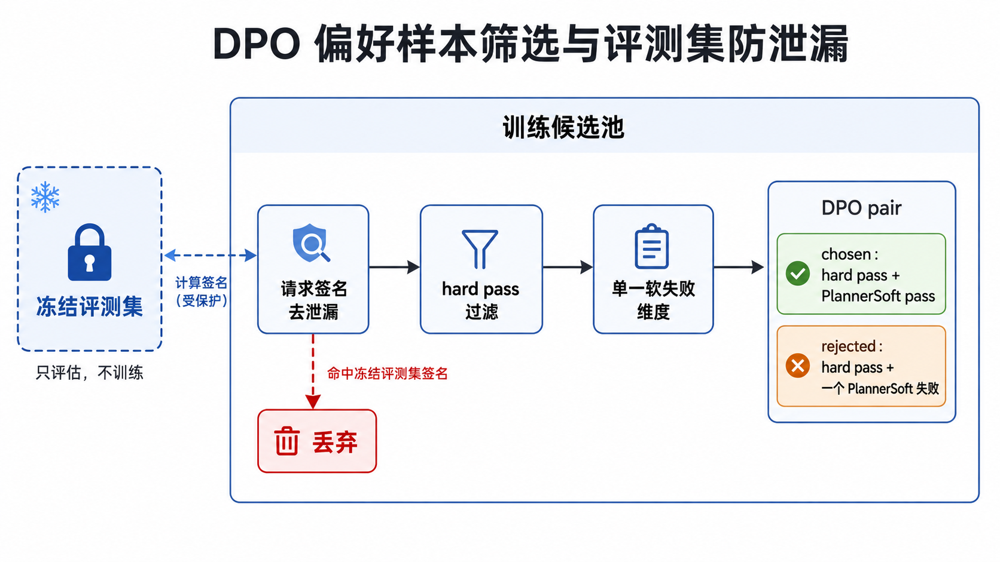

### 主指标换成 PlannerSoft

后来我越来越觉得，普通 softpass 还不够。旅行助手输出的不是一道选择题，而是一份用户可能真的拿去用的计划。所以主指标逐步转成 `planner soft`：预算贴合、餐饮重复、景点重复、预算关系这些都要看。

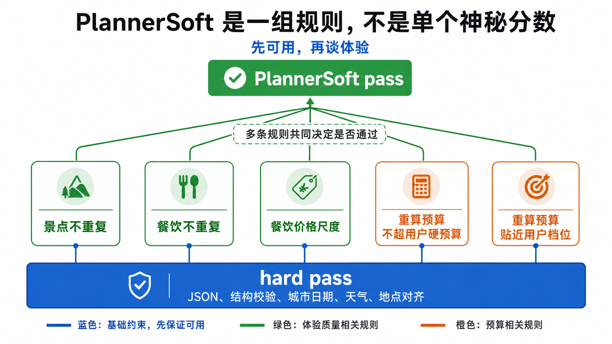

几轮 DPO 的路线大概是：

| 阶段 | 目的 | 结论 |
| --- | --- | --- |
| 高置信偏好 DPO 试跑 | 先验证长上下文 DPO 能跑通 | 流程跑通，后面开始换指标 |
| PlannerSoft 规则 DPO | 把优化目标从 hardpass 转向 planner soft | 选出第一个可继续扩数据的 DPO 起点（ckpt25） |
| PlannerSoft 扩数据 + Direct 锚定 | 扩大 planner soft 数据，同时保留 direct preference | 得到更稳的扩数据基线（ckpt126） |
| PlannerSoft Clean 单生成提升 | 用更大规模 clean 数据继续训 | 单生成最好的一版（260519 ckpt138） |
| 预算收尾 DPO | 针对预算偏保守、超支、重复构造 clean pair | 单生成没继续涨，但候选池更适合 rerank（260520 / 260521） |

DPO loss 也别跨批次硬比。前几轮 pair 很容易分，loss 低、accuracy 高；预算收尾 pair 更接近，chosen 和 rejected 都是 hardpass 计划，只是在预算使用、重复和偏好上有差别，loss 高一点反而正常。


我后来更看重两个信号：reward accuracy 有没有稳定上来，frozen eval 上 planner soft 和预算相关指标有没有真的动。训练日志让你知道这炉有没有坏，评测才告诉你这炉有没有用。

---

## 第十章：最终多候选 Rerank

DPO 后半段最容易误读。单生成最稳的是 PlannerSoft Clean 那版，也就是 260519 ckpt138；后面两轮预算收尾（260520 ckpt66、260521 ckpt64）没有把单生成分数继续推高。

但最终展示不是单生成，而是多候选 rerank。预算收尾的价值主要体现在候选池：它不一定让第一发回答更高分，但更容易采出能被规则选中的好答案。

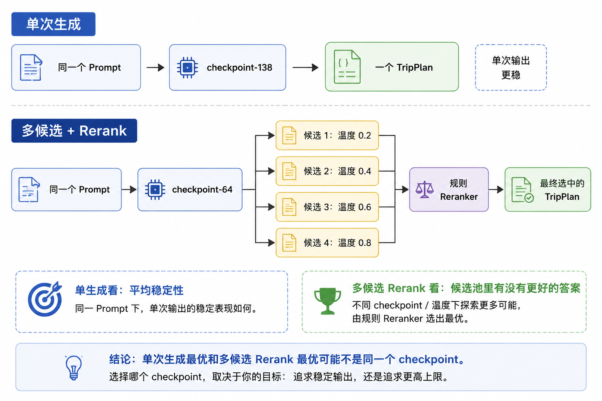

最终几组指标大概是：

| 版本 | hardpass | planner soft | 重算预算 soft |
| --- | ---: | ---: | ---: |
| 扩数据基线（ckpt126） | 98.4% | 66.9% | 48.5% |
| PlannerSoft Clean 单生成（260519 ckpt138） | 98.4% | 71.5% | 50.9% |
| 预算收尾第 1 轮单生成（260520 ckpt66） | 99.0% | 70.1% | 48.3% |
| 预算收尾第 2 轮单生成（260521 ckpt64） | 98.2% | 69.7% | 47.6% |
| 预算收尾第 2 轮 + 4 候选 rerank（260521 ckpt64） | **99.4%** | **80.6%** | **68.2%** |


所以不能简单说“最后一炉单生成最好”。我会这么记：

- 单生成最佳：PlannerSoft Clean 单生成版（260519 ckpt138）。
- 多生成 rerank 最佳：预算收尾第 2 轮 + 4 候选 rerank（260521 ckpt64）。
- 展示主推：260521 ckpt64 rerank n4，500 条 planner soft `80.6%`，hard split planner soft `77.0%`。

单生成看的是一次采样的平均质量；rerank 看的是候选池里有没有更好的答案，以及规则能不能把它选出来。两者可以不是同一个 checkpoint。

---

## 第十一章：和 MiMo 外部参考怎么比

最后可以加一个外部强模型参照，但这块一定要写清楚口径。MiMo 不是我们这条 LoRA 训练线里的 checkpoint，也不是严格同一套脚本、同一版规则下的 leaderboard。更合适的用法是：看它告诉我们强模型大概会在哪里强，哪里和本地规则不完全合拍。

我还拿 MiMo v2.5 Pro 外部 API 做过参考评测。为了避免输出长度限制影响结论，当时把 max token 放大了一些。和最终本地版放在一起看，大概是这样：

| 模型 | hardpass | planner soft | 重算预算 soft | 预算偏好 | 重算预算贴合 |
| --- | ---: | ---: | ---: | ---: | ---: |
| MiMo v2.5 Pro（放大 max token） | 98.8% | 78.7% | **76.6%** | 85.5% | **82.4%** |
| 本地最终版（260521 ckpt64 rerank n4） | **99.4%** | **80.6%** | 68.2% | **86.0%** | 73.4% |


这张表我会这么看：

- 本地最终版在本项目规则口径下，`hardpass` 和 `planner soft` 已经追上并略高于 MiMo 参考。
- MiMo 的重算预算 soft 和重算预算贴合仍然更强，说明预算总额控制这件事它做得更稳。
- MiMo 的预算关系、餐饮尺度在早期报告里不算高，主要是它会给出更真实的人均餐费，但这些餐费有时低于我们当前规则档位的下限。

所以我不会写成“全面超过 MiMo”。更稳妥的说法是：在本项目这套冻结评测和规则口径下，最终本地模型的 planner soft 已经追平强模型参考；预算贴合还有差距，后面真要继续做，就补预算总额控制和预算档位之间的协调。


---

## Bad Case Gallery：三个最值钱的错误

后训练里最有用的东西，往往不是最好看的成功样例，而是那些反复打脸的 bad case。我最后留下三类：预算合计错、餐饮重复或不 grounded、酒店晚数和房间数没算对。

### 1. 预算合计错：看起来像小账，其实会直接打穿 hard budget

第一个例子是济南 3 天，1 人出差顺便玩，硬预算 3200 元。模型输出里的预算字段长这样：

```json
{
  "total_attractions": 240,
  "total_hotels": 2600,
  "total_meals": 1748,
  "total_transportation": 400,
  "total": 5088
}
```

问题有两层。

第一层是算术就不对：`240 + 2600 + 1748 + 400 = 4988`，但模型写成了 `5088`。第二层更麻烦，rule 按每天餐费重算后发现，真实餐饮合计应该是 `1928`，不是 `1748`。也就是说，它既写错了分项，又写错了总数，还把 3200 的 hard budget 超了。

rule 抓到的是：

```text
budget_arithmetic_inconsistent: part_sum=4988, total=5088, diff=-100
meal_budget_inconsistent: expected_total_meals=1928, reported_total_meals=1748
budget_hard_constraint_exceeded: requested_budget=3200, total=5088
```

后来怎么修？我没有继续指望模型自己把所有账算准，而是把预算评测拆成两套：一套看模型声明的 `budget.total`，一套用景点、酒店、餐饮、交通重新算 `recomputed_budget`。训练和 rerank 里也把预算算术、预算关系、预算贴合拆开看。这样模型可以继续负责选项和行程，账本由规则兜底。

### 2. 餐饮重复：不是不能吃同一家，是不能一路偷懒

第二个例子是长沙 4 天，亲子和老人友好。模型确实找到了餐厅，但选得太偷懒：

```text
2026-03-08 lunch  新长福(世嘉店)
2026-03-08 dinner 新长福(世嘉店)
2026-03-10 dinner 新长福(世嘉店)
2026-03-11 dinner 新长福(世嘉店)
```

同一天午晚餐同一家，后面又继续重复。对模型来说这可能是“稳妥的本地餐厅”，但对用户来说，4 天里反复吃同一家店就很不像一个认真做过的行程。

rule 抓到的是：

```text
meal_same_day_lunch_dinner_repeat: 2026-03-08 lunch/dinner 都是新长福(世嘉店)
meal_repeat_too_many: name_key=新长福, count=4, max_allowed=3
meal_diversity_ok=False
```

后来怎么修？餐饮这块不能只写“推荐特色餐厅”。我加了三类约束：同日午晚餐不能重复，同一餐厅族不能超过上限，餐厅最好来自工具候选而不是泛泛写“附近小吃”。Best-of-N Replay 和最终 rerank 里，也会把餐饮重复、多样性和 grounding 放进排序信号。这个改动很实用，因为它不要求模型一次生成完美答案，只要候选池里有一个更不重复的版本，rerank 就能把它捞出来。

### 3. 酒店晚数错：房间数比天数更容易被模型漏掉

第三个例子是北京 3 天，3 个朋友，住高端酒店。行程是 2026-01-07 到 2026-01-09，所以需要 2 晚；3 个成人通常要 2 间房。模型输出里每天酒店是这样：

```text
2026-01-07 华北宾馆 estimated_cost=1500
2026-01-08 华北宾馆 estimated_cost=1500
2026-01-09 无住宿
budget.total_hotels=3000
```

乍看没问题：2 晚，每晚 1500，总共 3000。但它漏了房间数。3 个朋友不是 1 间房住 2 晚，而是按策略应该算 2 间房住 2 晚，酒店预算至少应该覆盖 `1500 * 2 rooms * 2 nights = 6000`。

rule 抓到的是：

```text
hotel_budget_underestimated:
  lodging_nights=2
  party_total=3
  room_count=2
  expected_min_total_hotels=6000
  reported_total_hotels=3000
```

后来怎么修？这类问题不能指望模型在自然语言里“理解一下人数”。前端和后端要显式传 `party.total`，后端策略层要编译出 `room_count` 和 `lodging_nights`，评测里再用 `hotel_budget_covers_nights` 抓出来。训练数据也不能只写单人单房的简单样本，不然模型会默认“酒店价格 = 一间房一晚 * 晚数”，一遇到朋友、亲子、老人同行就漏账。

这三个 bad case 后来基本变成了我的排查顺序：先看账有没有加对，再看餐饮有没有偷懒，最后看酒店有没有按晚数和房间数覆盖。很多看起来很玄的模型问题，拆到这里其实都挺朴素。

---

## 第十二章：这次实验留下来的经验

这次做下来，我最确定的一件事是：Agent 后训练不是“多造点数据再训一下”这么简单。真正麻烦的是把产品协议、数据、训练、评测和推理策略对上。

最后我记下来的东西不复杂：

1. **先改产品协议。** 能结构化提交的字段，不要让模型猜。
2. **把上下文编译好。** 模型应该基于候选做选择，而不是凭空写事实。
3. **评测集先冻结。** 训练可以换数据，评测不要每轮换题。
4. **Prompt 调试用来找边界。** prompt 能解决的写进 prompt，解决不了的交给数据、规则或工程。
5. **强模型生成数据，但 teacher 必须被审计。** 像样不等于可训练。
6. **LoRA SFT 分阶段推进。** 每轮尽量只解决一类主要问题。
7. **Best-of-N Replay 和最终 Rerank 要分清。** 前者造训练数据，后者推理时选答案。
8. **DPO 只在合法候选之间学偏好。** 不要把格式修复 pair 当成偏好 pair。
9. **训练数据要避开冻结评测集。** 实验项目也没必要背题，重叠检查很便宜。
10. **指标拆开看。** hardpass、planner soft、预算关系、重算预算不要揉成一个总分。

最后我会这么收尾：

> 能结构化的交给工程，能规则化的做成评测，剩下那些真要模型学的，再放进 SFT 或偏好训练。

这样训出来的模型当然会更会说，但重点不在这。更重要的是，它能接进前后端；出了问题，规则能定位；下一轮还能继续修。

## 复现资源

想复现的话，从这些材料开始就行：

- 旅行助手项目仓库：[https://github.com/nameless0120/helloagents-trip-planner](https://github.com/nameless0120/helloagents-trip-planner)
- 完整教程：[旅行助手后训练实战教程](https://github.com/nameless0120/helloagents-trip-planner/blob/main/training/docs/%E6%95%99%E7%A8%8B/%E6%97%85%E8%A1%8C%E5%8A%A9%E6%89%8B%E5%90%8E%E8%AE%AD%E7%BB%83%E5%AE%9E%E6%88%98%E6%95%99%E7%A8%8B.md)
- 配套数据：`helloagents-后训练数据`，<https://pan.baidu.com/s/5oNsK7pwQnqzQEUg5ykb09Q>

硬件和脚本细节这篇不展开。简单说，这条主线依赖长上下文 LoRA；如果把上下文截短、换成 QLoRA 或改小 rank，也能跑，但就不是文中这条路线了。复现实验时，以 `helloagents-trip-planner` 仓库里的配置和归档为准。
